The rapid pace of technological innovation and the proliferation of digital systems have brought about unprecedented change in society. From the way we communicate and interact with each other to the way we work, learn, and conduct business, digital technologies have transformed nearly every aspect of our lives. The study of change in the digital age is a complex and multidisciplinary endeavor, drawing on insights from fields such as history, science and technology studies (STS), and future studies. For example, historians have explored how past technological revolutions, such as the [Industrial Revolution](https://www.history.com/topics/industrial-revolution/industrial-revolution) and the [Information Age](https://www.britannica.com/topic/Information-Age), have shaped society and culture, while STS scholars have examined the social, political, and ethical implications of emerging technologies such as [artificial intelligence](https://www.technologyreview.com/2021/06/25/1027133/ai-social-political-implications/) and [blockchain](https://www.sciencedirect.com/science/article/pii/S0160791X21000865).

## Mindmap

```mermaid
mindmap
  root)🌍 Change(
    Nature of Change{{🔄 Nature of Change}}
      (Evolution)
        [Gradual transformation]
        [Adaptation to new conditions]
      (Revolution)
        [Rapid and disruptive shifts]
        [Paradigm-altering innovations]
    Drivers of Change{{🚀 Drivers of Change}}
      (Technological Innovation)
        [Digital systems]
        [Artificial intelligence]
        [Blockchain]
      (Social and Cultural Factors)
        [Changing values and norms]
        [Demographic shifts]
        [Globalization]
      (Economic and Political Forces)
        [Market demand]
        [Government policies]
        [Geopolitical events]
    Debating Change{{🗳️ Debating Change}}
      (Progress)
        [Technological determinism]
        [Utopian vs. dystopian visions]
      (Ethics)
        [Privacy and security]
        [Equity and access]
        [Sustainability]
    Continuity and Discontinuity{{🌉 Continuity and Discontinuity}}
      (Historical Patterns)
        [Cycles of innovation]
        [Recurrent themes]
      (Forecasting)
        [Trend analysis]
        [Scenario planning]
        [Speculative design]
```

## Notes

### 2.1A: Change as the evolution, transformation, adaptation, or movement from one form, state, or value to another

- 🌱 **Evolution**: Gradual and incremental changes over time (e.g., the evolution of computing from [mainframes to personal computers](https://www.computerhistory.org/revolution/mainframe-computers/7/177))
- 💥 **Revolution**: Rapid and disruptive shifts that fundamentally alter the status quo (e.g., the impact of the [Internet on communication and commerce](https://www.internetsociety.org/internet/history-internet/brief-history-internet/))

  
🧠 How do technological revolutions differ from other forms of historical change?

- Technological revolutions are often driven by specific inventions or innovations that rapidly transform multiple sectors of society (e.g., the steam engine, the computer)
- They tend to have a more immediate and widespread impact on daily life, work, and social interactions
- Technological change is often seen as more deterministic or inevitable than other forms of historical change

### 2.1B: Change involves understanding and evaluating people, ideas, objects, and forces that shape the world: past, present, and future

- 🔬 **Technological innovation**: The development and adoption of new digital systems and technologies (e.g., [artificial intelligence](https://www.technologyreview.com/2021/06/25/1027133/ai-social-political-implications/), [blockchain](https://www.sciencedirect.com/science/article/pii/S0160791X21000865))
- 🌎 **Social and cultural factors**: Shifts in values, norms, demographics, and global connectivity (e.g., the impact of [social media on political discourse](https://www.pewresearch.org/internet/2020/07/22/the-state-of-online-harassment/))
- 💰 **Economic and political forces**: Market demands, government policies, and geopolitical events (e.g., the role of [tech giants in shaping the digital economy](https://www.nytimes.com/2022/05/15/opinion/big-tech-antitrust-regulation.html))

  
🧠 What obligations do we have toward future generations in the context of digital change?

- Ensuring that technological development is sustainable and does not compromise the well-being of future generations
- Promoting equity and access to the benefits of digital technologies across different populations and regions
- Preserving digital heritage and ensuring the long-term accessibility of digital information and cultural artifacts
- Fostering critical thinking, digital literacy, and ethical decision-making skills to navigate the challenges and opportunities of the digital future

### 2.1C: The nature and importance of change is debated

- 🚀 **Progress**: Discussions about whether technological change necessarily leads to social, economic, or moral progress (e.g., debates between [technological determinism](https://www.sciencedirect.com/topics/social-sciences/technological-determinism) and [social constructivism](https://www.sciencedirect.com/topics/social-sciences/social-constructivism))
- 🌈 **Ethics**: Considerations of the ethical implications of digital change, such as privacy, security, equity, and sustainability (e.g., the debate over [facial recognition technology](https://www.nytimes.com/2020/06/09/technology/facial-recognition-software.html))

  
🧠 Is progress an inevitable outcome of advances in digital systems and technologies?

- Technological progress does not always translate into social, economic, or moral progress; it depends on how the technologies are developed, deployed, and governed
- The benefits and risks of digital technologies are often unevenly distributed across different populations and regions
- There are often unintended consequences and trade-offs associated with technological change that need to be carefully considered and addressed

### 2.1D: Change may indicate continuity or discontinuity with prior established ways of understanding or doing things

- 🔁 **Historical patterns**: Identifying recurring themes, cycles, or trends in the history of technological change (e.g., the [hype cycle](https://www.gartner.com/en/research/methodologies/gartner-hype-cycle) of emerging technologies)
- 🔮 **Forecasting**: Using historical analysis, trend spotting, and speculative design to anticipate and prepare for future developments (e.g., [scenario planning](https://www.iftf.org/future-now/article-detail/five-principles-for-thinking-like-a-futurist/) for long-term strategic decision-making)

  
🧠 How might past events, patterns, or trends help us to forecast future developments?

- Studying historical analogues and precedents can provide insights into the potential trajectories and impacts of emerging technologies
- Identifying recurring patterns or cycles in technological change can help anticipate future waves of innovation and disruption
- Analyzing the social, economic, and political factors that have shaped past technological revolutions can inform our understanding of the forces driving current and future developments
- Engaging in speculative design and scenario planning exercises can help us envision and prepare for a range of possible futures

