## Mindmap

```mermaid

mindmap
	)Change(
    (📚 Types of Change)
      Form
      State
      Values
    (Nature of Change)
      Evolution
      Transformation
		(🔍 Pace of change)
        Incremental
        Radical
```

## What is Change?
  - Change is the process of moving from one form, state, or value to another. It can happen in various aspects of life and the world around us.
  - Examples include changing the state of matter (like ice melting into water), changes in societal values over time, or changes in technology.

## Types of Change:

- **Change of Form:**
  - **Definition:** This is when the physical appearance or structure of something is altered, leading to a noticeable difference in its external characteristics.
  - **Example:** The transition from bulky CRT monitors to slim, flat-screen LCD or OLED displays. This change represents a significant transformation in the physical appearance and design of computer monitors.

- **Change of State:**
  - **Definition:** This refers to a change in the condition or mode of operation, rather than its physical form. It's about how something functions or is used.
  - **Example:** The shift from primarily using local storage (like hard drives and CDs) to cloud storage solutions. This change reflects a transformation in the state of how data is stored and accessed, moving from physical to virtual environments.

- **Change of Values:**
  - **Definition:** This involves a shift in beliefs or attitudes in society.
  - **Example:** The growing emphasis on cybersecurity and data protection. As digital technologies have become more integrated into daily life, there has been a societal shift towards valuing and prioritizing the security and privacy of digital information.

## Nature of change

- **Evolution**
  - **Definition:** A slow and gradual development. It's like how things grow or improve bit by bit over a long time.
  - **Example:** The evolution of mobile phones. They started as large, bulky devices only for calling, and over many years, they have slowly become the small, powerful smartphones we use today, capable of doing much more than just making calls.

- **Transformation**
  - **Definition:** A big and often quick change that makes something very different from before. It's like a complete makeover.
  - **Example:** The transformation of physical newspapers to digital news platforms. This wasn't just a small change; it was a complete shift in how people read and access news, moving from paper to screens and changing the entire experience of staying informed.

## Pace of change

- **Incremental Change:**
  - **Definition:** This type of change is slow and gradual, similar to the growth of a plant. It may not be immediately noticeable but, over time, it leads to significant differences.
  - **Example:** Gradual improvements in computer processing power over the years. This type of change is exemplified in the steady advancements of computer CPUs, where each new generation incrementally enhances performance and efficiency.

- **Radical Change:**
  - **Definition:** This change is sudden and significant, often resembling a new invention that completely alters how people live or work. It's characterized by its rapid pace and potentially disruptive nature.
  - **Example:** The widespread and rapid adoption of video conferencing tools like Zoom and Microsoft Teams for remote work and learning during the COVID-19 pandemic. This shift was a drastic change from the traditional in-person work and learning environments, happening almost overnight and revolutionizing communication in the digital age.

| Change Type      | Advantages                                                                                       | Disadvantages                                                                                      |
|------------------|--------------------------------------------------------------------------------------------------|----------------------------------------------------------------------------------------------------|
| Incremental      | - Easier to manage and predict  - Less risky  - Allows for gradual adaptation and learning | - Can be slow to respond to major shifts  - May be less impactful in the short term             |
| Radical          | - Can lead to significant improvements quickly  - May solve problems more completely          | - Higher risk of failure  - Can cause disruption and resistance  - Harder to predict outcomes |

## Flashcards

<iframe src="https://quizlet.com/854762213/learn/embed?i=26rc5y&x=1jj1" height="500" width="100%"></iframe>

## Theories

**Innovation Diffusion Theory**

Everett Rogers, 1962
