The proliferation of digital creative tools and platforms has transformed the landscape of artistic expression. Digital art, music, and literature have emerged as new forms of creative expression that leverage the unique affordances of digital media, such as interactivity, generativity, and remixing. For example, the rise of [NFTs (non-fungible tokens)](https://www.nytimes.com/2022/03/18/arts/design/nft-art-market.html) has enabled digital artists to create and sell unique digital artworks, while also raising questions about the value, ownership, and authenticity of digital art. The expression of identity, culture, and politics through digital art and media has also become a powerful force for social change and activism, as seen in the use of digital art and hashtags in the [#BlackLivesMatter](https://www.nytimes.com/2020/06/23/arts/design/black-lives-matter-art.html) and [#MeToo](https://www.dazeddigital.com/artsandculture/article/43057/1/metoo-art-exhibition-denouncing-sexual-violence-tate-modern-london) movements.

## Mindmap

```mermaid
mindmap
  root)💬 Expression(
    As Act or Process{{🎤 As Act or Process}}
      (Modes)
        [Text]
        [Audio]
        [Visual]
        [Multimedia]
      (Media)
        [Social media]
        [Blogs]
        [Podcasts]
        [Digital art]
    Functions{{🎨 Functions}}
      (Storytelling)
        [Digital novels]
        [Web comics]
        [Podcasts]
      (World-building)
        [Video games]
        [Virtual worlds]
        [Fan fiction]
      (Artistic Innovation)
        [Generative art]
        [Algorithmic music]
        [Data visualization]
      (Political Activism)
        [Hashtag campaigns]
        [Online petitions]
        [Digital protests]
    Bringing People Together and Introducing Dilemmas{{🌐 Bringing People Together and Introducing Dilemmas}}
      (Community-building)
        [Online fan communities]
        [Digital activism networks]
      (Dilemmas)
        [Free speech vs. hate speech]
        [Privacy vs. transparency]
        [Intellectual property vs. remix culture]
```

## Notes

### 2.2A: Expression as the act, process, or instance of representing ideas, emotions, and/or experiences

- 📝 **Modes**: The various forms or channels through which expression can occur (e.g., text, audio, visual, multimedia)
- 💻 **Media**: The tools or platforms used for expression (e.g., [social media](https://www.oberlo.com/statistics/the-number-of-websites-operating-today), [blogs](https://www.blogginglaws.com/blogging-statistics/), [podcasts](https://www.edisonresearch.com/the-infinite-dial-2022/), [digital art](https://www.artsy.net/article/artsy-editorial-9-artists-pushing-boundaries-digital-art))

  
🧠 In what ways do digital systems influence how we express ourselves?

- Increased access to tools and platforms for creation and sharing (e.g., social media, digital publishing)
- New forms of expression enabled by digital technologies (e.g., interactive storytelling, virtual reality)
- Potential for greater reach and impact of individual and collective expression (e.g., viral content, online activism)
- Challenges related to privacy, security, and intellectual property in the digital realm

### 2.2B: Functions of expression

- 📖 **Storytelling**: Communicating narratives, experiences, or ideas through various forms (e.g., [digital novels](https://www.theguardian.com/books/booksblog/2015/jun/11/digital-novels-technology-new-fiction-forms), [web comics](https://www.cbr.com/best-webcomics-to-read-online/), [podcasts](https://www.thepodcasthost.com/storytelling/top-storytelling-podcasts/))
- 🌍 **World-building**: Creating immersive and imaginative environments or universes (e.g., [video games](https://www.gamedesigning.org/worldbuilding-in-game-design/), [virtual worlds](https://www.genesisworlds.com/virtual-world-building-process/), [fan fiction](https://www.theguardian.com/books/2022/mar/26/how-fanfiction-became-the-ultimate-storytelling-universe))
- 🎨 **Artistic innovation**: Pushing the boundaries of creative expression through digital tools and techniques (e.g., [generative art](https://www.artnome.com/news/2022/3/24/what-is-generative-art), [algorithmic music](https://www.musicradar.com/news/algorithmic-music-and-creativity), [data visualization](https://www.creativebloq.com/advice/data-visualization-art-projects))
- ✊ **Political activism**: Using digital platforms to raise awareness, mobilize support, or effect change (e.g., [hashtag campaigns](https://www.nytimes.com/2021/10/20/style/hashtag-activism.html), [online petitions](https://www.change.org/), [digital protests](https://www.nytimes.com/2020/06/11/opinion/protests-digital-activism.html))

  
🧠 What different kinds of stories are possible through digital media?

- Non-linear and interactive narratives that allow for user choice and exploration (e.g., choose-your-own-adventure stories, branching narratives in video games)
- Transmedia storytelling that spans multiple platforms and formats (e.g., a story that unfolds across social media, websites, and physical locations)
- Collaborative and crowdsourced storytelling that involves multiple creators and participants (e.g., fan fiction communities, Wikipedia)
- Data-driven and generative stories that use algorithms and data sets to create unique narratives (e.g., personalized news feeds, procedurally generated game worlds)

### 2.2C: Expression bringing people together and introducing dilemmas

- 👥 **Community-building**: Fostering connections, shared interests, and collective identity through digital expression (e.g., [online fan communities](https://www.theatlantic.com/technology/archive/2020/05/virtual-fan-communities-transcend-physical-space/611631/), [digital activism networks](https://www.jstor.org/stable/24571876))
- ⚖️ **Dilemmas**: Challenges and debates surrounding the limits, responsibilities, and consequences of digital expression (e.g., [free speech vs. hate speech](https://www.aclu.org/issues/free-speech/internet-speech), [privacy vs. transparency](https://www.eff.org/issues/privacy-and-digital-rights), [intellectual property vs. remix culture](https://www.nytimes.com/2022/03/27/arts/remix-culture-music-copyrights.html))

  
🧠 Are there forms of digital expression that should be limited? Who decides and how?

- Balancing free speech with the need to prevent harm, hate speech, or misinformation
- Determining the roles and responsibilities of individuals, platforms, and governments in regulating digital expression
- Navigating cultural differences and power dynamics in a global digital landscape
- Addressing the potential for digital expression to reinforce or challenge existing social, political, and economic inequalities

