The phenomenon of social media influencers and online personal branding illustrates the complex dynamics of identity in digital society. Influencers curate and perform idealized versions of themselves on social media platforms, often blurring the lines between authenticity and self-promotion. The rise of [influencer culture](https://www.nytimes.com/2023/01/06/technology/influencer-social-media-culture.html) has also given rise to new forms of social comparison, self-esteem issues, and commodification of identity. At the same time, social media has enabled marginalized and underrepresented groups to assert their identities and build communities of support and solidarity. The example of influencers highlights the ways in which digital technologies shape the construction, expression, and negotiation of personal and collective identities in the digital age.

## Mindmap

```mermaid
mindmap
  root)👤 Identity(
    As Defining Feature{{💫 As Defining Feature}}
      (Person)
      (Group)
      (Social Entity)
      (Community)
      (Understanding Digital Identity)
      (Robot Identity)
    As Fluid and Context-Dependent{{⏳ As Fluid and Context-Dependent}}
      (Change Over Time)
      (Context)
      (Perspectives of Others)
      (Online Identity Changes)
      (Technological Influences)
    Intersectionality{{⭕ Intersectionality}}
      (Aspects of Identity)
      (Intersectionality in Digital Contexts)
```

## Notes

### 2.3A: Identity as a defining feature
   - 👤 **Person**: An individual's sense of self, shaped by their experiences, beliefs, and interactions (e.g., [online personal profiles](https://www.forbes.com/sites/forbescoachescouncil/2020/09/28/how-to-build-an-online-personal-brand-that-stands-out/?sh=4c7927f73162), [digital portfolios](https://www.adobe.com/express/create/portfolio))
   - 👥 **Group**: A collective identity formed around shared characteristics, interests, or goals (e.g., [online communities](https://www.oberlo.com/statistics/the-number-of-websites-operating-today), [social media groups](https://www.socialmediatoday.com/news/facebook-launches-new-tools-to-help-maintain-and-manage-community-groups/596146/))
   - ⚙️ **Social entity**: An identity associated with a particular organization, institution, or movement (e.g., [digital brands](https://www.forbes.com/sites/forbesagencycouncil/2021/08/25/building-a-strong-digital-brand-in-a-digitally-disrupted-world/?sh=340a5c0f6df4), [online activism networks](https://www.jstor.org/stable/24571876))
   - 🌎 **Community**: A shared identity based on common values, experiences, or locations (e.g., [local online forums](https://www.quora.com/What-are-the-best-local-forums-on-the-internet), [global digital diasporas](https://www.nytimes.com/2023/04/04/world/europe/digital-diasporas-transnational-identities.html))

  
🧠 How do different fields and professions understand digital identity?

- 🧠 **Psychology**: Emphasis on individual cognition, behavior, and development in digital contexts
- 🌐 **Cultural studies**: Focus on the ways digital technologies shape and are shaped by cultural practices and representations
- 🗳️ **Political science**: Analysis of how digital identities influence political participation, mobilization, and governance
- 👫 **Anthropology and sociology**: Examination of the social and cultural dimensions of digital identity formation and expression
- 🤔 **Philosophy**: Exploration of the ethical, epistemological, and ontological implications of digital identity

  
🧠 Does a robot have an identity?

- Philosophical debates around machine consciousness, agency, and personhood
- Technical considerations of how AI systems represent and express themselves
- Social and cultural perspectives on the attribution of identity to non-human entities
- Legal and ethical questions surrounding the rights and responsibilities of AI agents

### 2.3B: Identity as fluid and context-dependent
   - ⏳ **Change over time**: How individual and collective identities evolve and adapt in response to new experiences, relationships, and technologies
   - 🌐 **Context**: The ways in which identities are expressed and interpreted differently across various digital platforms, communities, and situations
   - 👀 **Perspectives of others**: How identities are shaped by the perceptions, reactions, and interactions of other individuals and groups in digital spaces

  
🧠 How do online identities change over time?

- 🧒 Developmental changes across the lifespan (e.g., from childhood to adulthood)
- 💻 Adaptations to new technologies, platforms, and social norms
- 🔄 Shifts in personal interests, values, and relationships
- 🌍 Responses to changing social, cultural, and political contexts

  
🧠 How do digital systems and technologies influence or construct identity?

- 📊 Algorithmic curation and personalization of online experiences
- 🌐 Platform design and affordances that shape self-expression and interaction
- 📈 Data collection and profiling that categorize and target individuals
- 🔍 Digital tools and resources that enable identity exploration and experimentation

### 2.3C: Intersectionality of identities
   - 🔷 **Aspects of identity**: Age, nationality, religion, culture, gender, sexuality, race, ethnicity, social and economic class
   - ⭕ **Intersectionality**: The complex ways in which different aspects of identity interact and influence each other in digital contexts

  
🧠 To what extent do different aspects of our identity intersect on digital platforms?

- 👀 Representation and visibility of diverse identities in online spaces
- 🚫 Experiences of discrimination, marginalization, or empowerment based on intersectional identities
- 👥 Formation of intersectional digital communities and solidarity networks
- 🤲 Challenges and opportunities for expressing and negotiating multiple, overlapping identities online
- 🔒 Implications of intersectional data collection and analysis for privacy, fairness, and inclusion

