The dominance of tech giants like Google, Amazon, Facebook, and Apple (GAFA) exemplifies the concentration of power in the digital economy. These companies have amassed vast amounts of data, wealth, and influence through their control of key digital platforms and infrastructures, such as search engines, e-commerce marketplaces, social networks, and mobile operating systems. The power of [GAFA](https://www.nytimes.com/interactive/2022/10/18/technology/free-ad-instagram-facebook-snapchat.html) has raised concerns about monopolistic practices, data privacy, and the erosion of democratic institutions. At the same time, the rise of decentralized technologies like [blockchain](https://www.forbes.com/advisor/investing/cryptocurrency/blockchain-explained/) and [cryptocurrencies](https://www.nytimes.com/2023/03/20/technology/sam-bankman-fried-crypto-blockchain.html) has offered alternative visions of power distribution and governance in the digital world. The example of GAFA illustrates the complex interplay of corporate, governmental, and grassroots power in shaping the digital landscape.

## Mindmap

```mermaid
mindmap
  root)⚡ Power(
    As Social Relations{{👥 As Social Relations}}
      (Influence)
      (Control)
      (Embedded Power in Digital Systems)
    As Structural and Embedded{{🏛️ As Structural and Embedded}}
      (Institutions)
      (Organizations)
      (Governments)
      (Enabling or Constraining Power)
    Unequal Distribution{{⚖️ Unequal Distribution}}
      (Inequality)
      (Digital Divide)
      (Inevitability of Unequal Power Distribution)
      (Influencing Power Distribution)
```

## Notes

### 2.4A: Power as a feature of social relations
   - 💬 **Influence**: The ability to shape the opinions, behaviors, or decisions of others (e.g., [social media influencers](https://www.nytimes.com/2023/01/06/technology/influencer-social-media-culture.html), [online opinion leaders](https://www.forbes.com/sites/forbesagencycouncil/2022/07/07/the-rise-of-the-micro-influencer-in-a-post-pandemic-world/?sh=4ba22e1a1cf6))
   - 🔒 **Control**: The capacity to dictate or restrict the actions or choices of others (e.g., [platform moderation policies](https://transparency.fb.com/policies/community-standards/), [digital surveillance systems](https://www.eff.org/issues/mass-surveillance-technologies))

  
🧠 How is power embedded or exercised through a specific digital system, technology or platform?

- 📈 Algorithmic curation and recommendation systems that shape user attention and preferences
- 📊 Data collection and analysis that enables targeted advertising, profiling, and manipulation
- 📜 Platform policies and design choices that govern user behavior and expression
- 💻 Technological infrastructure and standards that determine access, interoperability, and innovation

### 2.4B: Power as structural and embedded
   - 🏛️ **Institutions**: Formal organizations and established practices that shape social, economic, and political life (e.g., [governments](https://www.whitehouse.gov/briefing-room/presidential-actions/2022/07/28/executive-order-on-advancing-biotechnology-and-biomanufacturing-innovation-for-a-sustainable-safe-and-secure-american-bioeconomy/), [corporations](https://www.theverge.com/22991763/amazon-meta-microsoft-trillion-dollar-companies-big-tech-apple-google-facebook), [educational systems](https://www.edweek.org/technology/how-has-digital-learning-changed-education/2022/03))
   - 👩‍💼 **Organizations**: Groups of people with shared goals, resources, and structures (e.g., [tech companies](https://www.visualcapitalist.com/tech-giants-big-tech-trillion-dollar-companies/), [digital rights advocacy groups](https://www.eff.org/))
   - ⚖️ **Governments**: The systems and apparatus of the state that create and enforce laws, policies, and regulations (e.g., [national digital strategies](https://digital-strategy.ec.europa.eu/en/policies/countries-digitisation-governance), [internet governance frameworks](https://www.intgovforum.org/multilingual/))

  
🧠 Do digital systems and technologies enable or constrain the exercise of power?

- 💪 Empowerment of individuals and communities through access to information, communication, and resources
- 🏦 Concentration of power in the hands of a few dominant platforms, companies, or governments
- 👁️ Creation of new forms of surveillance, control, and manipulation through digital means
- 🔥 Disruption of traditional power structures and emergence of new forms of grassroots activism and resistance

### 2.4C: Unequal distribution of power
   - ⚖️ **Inequality**: The uneven distribution of resources, opportunities, and influence among individuals and groups in digital society
   - 🌐 **Digital divide**: The gap between those who have access to and can effectively use digital technologies and those who do not

  
🧠 Is it inevitable that power in digital society is unequally distributed?

- ⌛ Historical and structural factors that shape the development and adoption of digital technologies
- 🧱 Economic and social inequalities that are reproduced or amplified in digital contexts
- 📚 Differences in digital literacy, skills, and cultural capital that influence online participation and influence
- ✖️ Intersectional nature of digital inequalities, reflecting broader patterns of marginalization and privilege

  
🧠 How might digital systems and technologies influence the distribution of power?

- 🗳️ Democratization of access to information, communication, and creative tools
- 🏢 Monopolization of digital infrastructure and platforms by a few dominant actors
- 📉 Algorithmic bias and discrimination that reinforces existing social hierarchies and prejudices
- ✊ Digital activism and collective action that challenges and reshapes power relations
- 🔗 Emerging technologies (e.g., blockchain, decentralized networks) that enable new forms of distributed power and governance

