The rise of remote work and virtual collaboration tools during the COVID-19 pandemic has transformed the nature of work and the boundaries between physical and digital spaces. Platforms like [Zoom](https://zoom.us/), [Microsoft Teams](https://www.microsoft.com/en-us/microsoft-teams/group-chat-software), and [Slack](https://slack.com/) have enabled people to work, learn, and socialize from anywhere with an internet connection, blurring the lines between home and office, public and private, local and global. The shift to remote work has also highlighted issues of digital inequality, as access to reliable internet and suitable work environments remains uneven across different communities and regions. The example of remote work shows how digital technologies are reshaping the geography of human activity and interaction, creating new opportunities and challenges for individuals, organizations, and societies.

## Mindmap

```mermaid
mindmap
  root)🌍 Space(
    Organization, Construction, and Representation{{🗺️ Organization, Construction, and Representation}}
      (Locations)
      (Regions)
      (Borders)
      (Zones)
      (Experiencing Specific Spaces)
      (Meaning of Physical Borders)
    Functions{{🏰 Functions}}
      (Social Spaces)
      (Economic Spaces)
      (Cultural Spaces)
      (Political Spaces)
      (Digital Divides in Spaces)
      (Online vs Physical Space)
    Access, Movement, and Flows{{🚦 Access, Movement, and Flows}}
      (Access)
      (Movement)
      (Flows)
      (Media Flows)
    Multiple Scales and Dimensions{{🔳 Multiple Scales and Dimensions}}
      (Local)
      (Regional)
      (National)
      (Global)
      (Virtual)
      (Physical and Virtual Space Influence)
```

## Notes

### 2.5A: Organization, construction, and representation of space
   - 📍 **Locations**: Specific points or areas in physical or virtual space (e.g., [GPS coordinates](https://www.gps.gov/), [virtual world locations](https://www.worldbuildingacademy.com/virtual-world-construction/))
   - 🌐 **Regions**: Areas defined by shared characteristics or boundaries (e.g., [digital economic zones](https://www.weforum.org/agenda/2022/02/digital-free-trade-zones/), [online cultural regions](https://www.newworldencyclopedia.org/entry/Cultural_region))
   - 🌐 **Borders**: Lines or boundaries that separate different spaces or jurisdictions (e.g., [national internet firewalls](https://en.wikipedia.org/wiki/Internet_censorship), [virtual property boundaries](https://www.worldbuildingacademy.com/virtual-property/))
   - 🔳 **Zones**: Areas designated for specific purposes or activities (e.g., [online gaming zones](https://www.pcgamer.com/top-online-games-worlds-to-visit/), [digital free trade zones](https://www.sgs.gov.sg/dss/dss.gov.sg))

  
🧠 How do digital systems and technologies affect how we experience specific spaces and locations?

- 🤖 Augmented reality and location-based services that overlay digital information on physical spaces
- 🌌 Virtual and immersive environments that create new forms of spatial experience and interaction
- 🗺️ Digital mapping and navigation tools that shape our understanding and use of physical spaces
- 👁️ Surveillance and tracking technologies that monitor and regulate movement through spaces

  
🧠 Do physical or political borders still have meaning in a digital society?

- 🌐 Digital technologies that enable cross-border communication, commerce, and collaboration
- 🇺🇸 National and regional differences in internet infrastructure, regulation, and censorship
- 👥 Virtual communities and identities that transcend physical borders and boundaries
- ⚔️ Geopolitical tensions and conflicts that are played out in digital spaces and networks

### 2.5B: Functions of different spaces
   - 👥 **Social spaces**: Environments that facilitate communication, interaction, and community-building (e.g., [social media platforms](https://www.oberlo.com/statistics/the-number-of-websites-operating-today), [online forums](https://www.quora.com/What-are-the-best-online-forums))
   - 💰 **Economic spaces**: Environments that enable commerce, trade, and financial transactions (e.g., [e-commerce marketplaces](https://www.statista.com/statistics/245621/leading-global-online-marketplaces-based-on-gross-merchandise-value/), [digital payment systems](https://www.investopedia.com/articles/personal-finance/122315/digital-payment-systems-world-around-us.asp))
   - 🎭 **Cultural spaces**: Environments that support the expression, sharing, and preservation of cultural practices and identities (e.g., [online museums](https://www.travelandleisure.com/attractions/museums-galleries/best-virtual-museum-tours), [digital archives](https://www.archives.gov/digital-archives))
   - ⚖️ **Political spaces**: Environments that enable participation, mobilization, and governance (e.g., [online voting systems](https://www.cdc.gov/voteraccess/online_voting.html), [digital activism networks](https://www.jstor.org/stable/24571876))

  
🧠 In what kinds of spaces do digital divides exist?

- 📶 Unequal access to internet infrastructure and devices in different geographic regions and socioeconomic contexts
- 💻 Disparities in digital literacy and skills across different demographic groups and communities
- 🚫 Exclusionary design and governance of digital platforms and spaces that marginalize certain voices and perspectives
- 🏘️ Digital redlining and discrimination that reinforces spatial segregation and inequality

  
🧠 How does online space differ from physical space? How are they similar?

- 💫 Differences in materiality, embodiment, and physicality between online and offline spaces
- 🧑‍🤝‍🧑 Similarities in social norms, power dynamics, and patterns of interaction across digital and physical environments
- 🌉 Blurring of boundaries between online and offline spaces through hybrid and augmented realities
- 🔄 Interdependence and mutual shaping of digital and physical spaces in contemporary society

### 2.5C: Access, movement, and flows in space
   - 🚪 **Access**: The ability to enter, use, and benefit from different spaces and resources in digital society
   - 🚶‍♂️ **Movement**: The ability to navigate, traverse, and travel through different spaces in digital society
   - 🌊 **Flows**: The patterns and processes of circulation and exchange (e.g., of information, goods, people) through different spaces in digital society

  
🧠 How does media circulate and move through digital society?

- 🔥 Viral spread and sharing of digital content across online networks and platforms
- 📈 Algorithmic curation and recommendation systems that shape the flow of information and attention
- 🌐 Cross-border and cross-platform flows of data, capital, and labor in the global digital economy
- 🔒 Regulation and control of media flows through content moderation, copyright enforcement, and censorship

### 2.5D: Multiple scales and dimensions of space
   - 🏘️ **Local**: Spaces and communities defined by geographic proximity and shared physical environments
   - 🌆 **Regional**: Spaces and communities defined by shared cultural, economic, or political characteristics across a broader geographic area
   - 🇺🇸 **National**: Spaces and communities defined by the boundaries and institutions of the nation-state
   - 🌍 **Global**: Spaces and communities that span and connect multiple regions and nations across the world
   - 💻 **Virtual**: Spaces and communities that exist primarily in digital form, without direct physical embodiment or location

  
🧠 To what extent does physical space influence virtual space (and vice versa)?

- 🌉 Physical infrastructure and geography that shape the development and use of digital technologies in different regions and communities
- 🏛️ Cultural and social norms from physical spaces that are reproduced or challenged in virtual environments
- 🌐 Virtual spaces and communities that enable new forms of transnational and transcultural connection and collaboration
- ⚡ Feedback loops and mutual shaping between online and offline spaces, as digital technologies become increasingly integrated into everyday life

