Consider a ride-sharing platform like Uber as a digital system. It involves interacting elements such as users (riders and drivers), mobile devices, mapping technologies, payment systems, and algorithms for matching supply and demand. The platform is interdependent with broader transportation infrastructures, labor markets, and regulatory frameworks. The introduction of dynamic pricing algorithms on the platform had both intended consequences (improved service availability and efficiency) and unintended consequences (increased consumer costs and driver stress). Data visualizations of ride patterns and user feedback can help reveal insights and opportunities for improving the system's design and governance.

## Mindmap

```mermaid
mindmap
  root)🔄 Systems(
    Structure and Order{{🏛️ Structure and Order}}
      (Human Systems)
      (Natural Systems)
      (Built Systems)
      (Digital vs Social Systems)
    Interacting and Interconnected Elements{{⚙️ Interacting and Interconnected Elements}}
      (Interacting Elements)
      (Interdependent Elements)
      (Interconnected Elements)
      (Human Elements in Design and Use)
    Changes and Consequences{{➕ Changes and Consequences}}
      (Intended Consequences)
      (Unintended Consequences)
    Models, Maps, and Visualizations{{🗺️ Models, Maps, and Visualizations}}
      (Models)
      (Maps)
      (Visualizations)
      (Insights from Models and Maps)
```

## Notes

### 2.6A: Systems as a way to think about structure and order
   - 👥 **Human systems**: Social, economic, and political structures that shape human behavior and relationships (e.g., [online communities](https://www.oberlo.com/statistics/the-number-of-websites-operating-today), [digital marketplaces](https://www.statista.com/statistics/245621/leading-global-online-marketplaces-based-on-gross-merchandise-value/), [e-government services](https://www.mckinsey.com/industries/public-and-social-sector/our-insights/how-government-digital-services-generate-economic-value))
   - 🌳 **Natural systems**: Ecological and environmental processes and interactions (e.g., [climate modeling](https://www.climate.gov/maps-data/datasets/climate-model-data), [biodiversity databases](https://www.gbif.org/), [remote sensing technologies](https://www.usgs.gov/core-science-systems/ngt/remote-sensing))
   - 🏙️ **Built systems**: Designed and constructed environments and infrastructures (e.g., [smart cities](https://www.smartcitiesworld.net/what-is-a-smart-city), [transportation networks](https://www.transportation.gov/policy/transportation-systems-management-and-operations/transportation-systems-mapping), [energy grids](https://www.eia.gov/energyexplained/electricity/delivery-to-consumers.php))

  
🧠 Are digital systems distinct from social systems?

- 🔄 Similarities in patterns of interaction, communication, and organization between digital and social systems
- 💫 Differences in materiality, embodiment, and physicality between digital and social systems
- ⏳ Co-evolution and mutual shaping of digital technologies and social structures over time
- 🆕 Emergence of new forms of social organization and behavior through digital systems (e.g., [online communities](https://www.oberlo.com/statistics/the-number-of-websites-operating-today), [virtual economies](https://www.investopedia.com/terms/v/virtual-economy.asp))

### 2.6B: Systems as sets of interacting, interdependent, and/or interconnected elements
   - ⚙️ **Interacting elements**: Components of a system that influence and respond to each other (e.g., users, devices, algorithms in a [social media platform](https://www.oberlo.com/statistics/the-number-of-websites-operating-today))
   - 🔗 **Interdependent elements**: Components of a system that rely on and support each other (e.g., hardware, software, and data in a [computer network](https://www.cisco.com/c/en/us/solutions/data-center-virtualization/what-is-a-computer-network.html))
   - 🔌 **Interconnected elements**: Components of a system that are linked and related to each other (e.g., [hyperlinks](https://www.semrush.com/blog/what-is-a-hyperlink/), [APIs](https://www.mulesoft.com/resources/api/what-is-an-api), and [data flows](https://en.wikipedia.org/wiki/Data_flow) between websites and applications)

  
🧠 What are the human elements involved in the design or use of a specific digital system?

- 👤 Users and their needs, preferences, behaviors, and experiences within the system
- 👷 Designers and developers who create and maintain the system's architecture, functionality, and interface
- 👨‍💼 Stakeholders and their interests, values, and power dynamics in shaping the system's purpose and governance
- 🌍 Broader social, cultural, and political contexts that influence the system's adoption, use, and impact

### 2.6C: Changes within a system and their consequences
   - 🎯 **Intended consequences**: Planned or desired outcomes of changes within a system (e.g., improved efficiency, enhanced user experience)
   - ⚠️ **Unintended consequences**: Unexpected or adverse effects of changes within a system (e.g., social polarization, privacy violations, environmental impacts)

  
🧠 How might a new technology result in unintended consequences in digital society?

- 💥 Disruption of existing social, economic, or political structures and relationships
- 📈 Amplification of existing inequalities, biases, or power imbalances within the system
- ⚠️ Emergence of new forms of risk, vulnerability, or harm for individuals and communities
- 🔄 Adaptation and appropriation of the technology for purposes beyond its original design and intent

### 2.6D: Models, maps, and visualizations of systems
   - 🧩 **Models**: Simplified representations of a system's components, relationships, and behaviors (e.g., [data flow diagrams](https://www.lucidchart.com/pages/data-flow-diagram), [user journey maps](https://www.nngroup.com/articles/user-journey-mapping/), [system dynamics models](https://www.systemswiki.org/index.php?title=System_Dynamics_Models))
   - 🗺️ **Maps**: Spatial representations of a system's elements and their connections (e.g., [network topologies](https://www.cisco.com/c/en/us/products/collateral/switches/small-business-500-series-managed-switches/data_sheet_c78-744156.html#_Toc453615326), [information architectures](https://www.nngroup.com/articles/information-architecture-defined/), [ecosystem maps](https://www.designcouncil.org.uk/resources/guide/design-methods-ecosystem-mapping))
   - 📊 **Visualizations**: Graphical or interactive representations of a system's data, patterns, and insights (e.g., [dashboards](https://www.tableau.com/solutions/dashboard), [infographics](https://www.venngage.com/features/infographic-maker), [data visualizations](https://www.tableau.com/learn/articles/data-visualization))

  
🧠 What do models and maps reveal about a digital system or technology?

- 🧱 Structure and organization of the system's components and their relationships
- 📈 Patterns and trends in the system's behavior and performance over time
- ⚠️ Gaps, bottlenecks, or vulnerabilities in the system's design or operation
- 💡 Opportunities for optimization, innovation, or transformation of the system
- 👥 Stakeholder perspectives and experiences within the system
- 🌍 Broader impacts and implications of the system within its social, cultural, and environmental contexts

