The development of facial recognition technologies raises significant ethical questions and challenges. Designers of these technologies must grapple with issues of privacy, consent, fairness, and accountability. Different ethical frameworks, such as utilitarianism (maximizing overall benefit) or deontology (respecting individual rights), may lead to conflicting recommendations for the design and deployment of facial recognition systems. Professional codes of ethics, such as the ACM Code of Ethics, provide guidance for designers to consider the potential harms and risks of their technologies, and to prioritize the well-being and rights of users and society. Laws and regulations, such as the EU's General Data Protection Regulation (GDPR), establish legal requirements and safeguards for the collection, use, and protection of biometric data. Ultimately, the ethical design of facial recognition technologies requires ongoing dialogue, scrutiny, and governance to ensure that they align with societal values and promote human flourishing.

## Mindmap

```mermaid
mindmap
  )⚖️ Values and Ethics(
    (Determining Distinctions)
      [Right and wrong]
      [Fair and unfair]
      [Just and unjust]
      [Legal and illegal]
      [Proper and improper]
    (Programming Ethics into AI)
    (Universal Digital Ethics)
    (Guiding Human Action)
      [Individual conduct]
      [Group conduct]
      [Decision-making]
    (Robot Ethics)
    (Types of Values and Ethics)
      [Personal values and ethics]
      [Shared values and ethics]
      [Collective values and ethics]
      [Professional values and ethics]
    (Hacker Ethics)
    (Frameworks, Codes, Rules, Policies, Laws)
      [Frameworks]
      [Codes]
      [Rules]
      [Policies]
      [Laws]
    (Conflicting Ethical Frameworks)
    (Influencing and Shaping the Digital World)
      [Ideas]
      [Objects]
      [Practices]
      [Systems]
      [Spaces]
    (Designer Obligations)
```

## Notes

### 2.7A: Values and ethics as ways to determine distinctions
   - 💡 **Right and wrong**: Moral or ethical principles that guide behavior and decision-making (e.g., respect for privacy, honesty in online communication)
   - ⚖️ **Fair and unfair**: Principles of equality, justice, and impartiality in the treatment of individuals and groups (e.g., [algorithmic fairness](https://www.acm.org/binaries/content/assets/public-policy/2017_usacm_statement_algorithms.pdf), [digital inclusion](https://www.itu.int/en/mediacentre/backgrounders/Pages/digital-inclusion.aspx))
   - ⚖️ **Just and unjust**: Principles of righteousness, equity, and morality in the distribution of benefits and burdens (e.g., [digital rights](https://www.un.org/en/digital-cooperation-roadmap/), [access to technology](https://www.itu.int/en/mediacentre/Pages/2021-PR24.aspx))
   - ⚖️ **Legal and illegal**: Rules and regulations established by law to govern behavior and enforce consequences (e.g., [data protection regulations](https://gdpr.eu/), [intellectual property laws](https://www.wipo.int/about-ip/en/))
   - 🤝 **Proper and improper**: Standards of appropriate or acceptable conduct in a given context or community (e.g., [online etiquette](https://www.intel.com/content/www/us/en/education/k12/online-etiquette-guide.html), [professional codes of conduct](https://www.acm.org/code-of-ethics))

  
🧠 Can we program or code values and ethics into AI?

- Challenges in defining and formalizing ethical principles for AI systems
- Techniques for embedding values and ethics into AI algorithms and decision-making processes (e.g., value alignment, constrained optimization)
- Limitations and risks of relying on programmed ethics in AI (e.g., value misalignment, unintended consequences)
- Importance of human oversight, accountability, and governance in the development and deployment of ethical AI

  
🧠 Can there be a universal system of digital ethics?

- Diversity of cultural, religious, and philosophical traditions that shape ethical frameworks and values
- Challenges in reaching consensus on universal ethical principles for the digital world
- Potential for a common set of core values and principles to guide digital ethics (e.g., human rights, dignity, fairness, transparency)
- Importance of pluralism, dialogue, and collaboration in developing shared ethical frameworks for the digital age

### 2.7B: Values and ethics as guides for human action
   - 👤 **Individual conduct**: Personal values and ethics that shape one's behavior and decision-making in the digital world (e.g., [online integrity](https://www.techtransfercentral.com/2020/06/02/online-integrity-and-digital-ethics/), [digital citizenship](https://www.iste.org/areas-of-focus/digital-citizenship))
   - 👥 **Group conduct**: Shared values and ethics that guide the behavior and decision-making of a collective or community in the digital world (e.g., [online community standards](https://www.redditinc.com/policies/content-policy), [organizational values](https://www.microsoft.com/en-us/microsoft-365/blog/2018/02/01/strengthening-digital-trust-our-shared-responsibility/))
   - 🤔 **Decision-making**: The process of making choices and taking actions based on values and ethical considerations (e.g., [responsible innovation](https://www.rri-tools.eu/), [ethical design](https://www.smashingmagazine.com/2021/06/ethical-design-principles-emotional/))

  
🧠 Do robots have ethics? Should they?

- Philosophical debates on the moral status and agency of robots and AI systems
- Potential for robots to exhibit ethical behavior through programmed rules or learned behaviors
- Challenges in ensuring the alignment of robot ethics with human values and principles
- Importance of human responsibility and accountability in the design and deployment of ethical robots

### 2.7C: Types of values and ethics
   - 👨‍🦱 **Personal values and ethics**: Individual beliefs, principles, and standards that guide one's behavior and decision-making (e.g., honesty, compassion, integrity)
   - 👪 **Shared values and ethics**: Common beliefs, principles, and standards that guide the behavior and decision-making of a group or community (e.g., social responsibility, environmental sustainability)
   - 🌍 **Collective values and ethics**: Broader cultural, societal, or global beliefs, principles, and standards that shape the behavior and decision-making of larger collectives (e.g., human rights, digital solidarity)
   - 👷‍♀️ **Professional values and ethics**: Specific beliefs, principles, and standards that guide the behavior and decision-making of individuals within a particular profession or field (e.g., [journalistic ethics](https://www.spj.org/ethicscode.asp), [data ethics](https://www.gov.uk/government/publications/data-ethics-framework/data-ethics-framework))

  
🧠 Do hackers share values or an ethical code?

- Diversity of hacker cultures and motivations (e.g., white hat, black hat, grey hat hackers)
- Common values and principles among hacker communities (e.g., freedom of information, privacy, security)
- Ethical debates and dilemmas within hacker communities (e.g., responsible disclosure, hacktivism)
- Relationship between hacker ethics and broader societal values and norms

### 2.7D: Frameworks, codes, rules, policies, and laws expressing values and ethics
   - 🧭 **Frameworks**: Conceptual structures that organize and guide ethical thinking and decision-making (e.g., [consequentialism](https://plato.stanford.edu/entries/consequentialism/), [deontology](https://plato.stanford.edu/entries/deontological-ethics/), [virtue ethics](https://plato.stanford.edu/entries/ethics-virtue/))
   - 📚 **Codes**: Sets of principles or rules that establish standards of conduct for a particular group or profession (e.g., [ACM Code of Ethics](https://www.acm.org/code-of-ethics), [IEEE Code of Ethics](https://www.ieee.org/about/corporate/governance/p7-8.html))
   - 📜 **Rules**: Specific guidelines or instructions that prescribe or prohibit certain behaviors or actions (e.g., [terms of service](https://www.facebook.com/terms.php), [community guidelines](https://www.reddit.com/wiki/contentpolicy))
   - 📝 **Policies**: Formal statements or plans that guide decision-making and action within an organization or system (e.g., [privacy policies](https://policies.google.com/privacy), [content moderation policies](https://transparency.fb.com/policies/community-standards/))
   - ⚖️ **Laws**: Legal requirements or prohibitions that govern behavior and enforce consequences (e.g., [data protection laws](https://gdpr.eu/), [anti-discrimination laws](https://www.un.org/en/observances/ending-racial-discrimination-day))

  
🧠 What happens when different ethical frameworks are applied to the same issue in digital society?

- Potential for conflicting or contradictory ethical judgments and recommendations
- Importance of context, stakeholder perspectives, and cultural values in shaping ethical analyses
- Opportunities for dialogue, negotiation, and compromise in resolving ethical dilemmas
- Role of ethical pluralism and moral imagination in navigating complex ethical landscapes

### 2.7E: Values and ethics influencing and shaping the digital world
   - 💡 **Ideas**: Values and ethics shaping the concepts, theories, and discourses that guide digital innovation and practice (e.g., [privacy by design](https://www.ipc.on.ca/privacy-by-design/), [digital humanism](https://www.un.org/en/digital-cooperation-roadmap/))
   - 💻 **Objects**: Values and ethics embedded in the design, functionality, and aesthetics of digital artifacts and technologies (e.g., [inclusive design](https://www.microsoft.com/design/inclusive/), [sustainable hardware](https://www.dell.com/en-us/dt/corporate/corp-comm/sustain-hardware-solutions.htm))
   - 👥 **Practices**: Values and ethics informing the behaviors, norms, and interactions of individuals and communities in the digital world (e.g., [digital citizenship](https://www.iste.org/areas-of-focus/digital-citizenship), [online activism](https://www.nytimes.com/2020/06/11/opinion/protests-digital-activism.html))
   - 🌐 **Systems**: Values and ethics underlying the structures, processes, and governance of digital platforms, networks, and infrastructures (e.g., [decentralized systems](https://www.eff.org/deeplinks/2020/11/open-source-decentralization-and-4-web-alternatives-dominating-privately-owned-online), [platform cooperativism](https://www.platformcoop.net/))
   - 🌍 **Spaces**: Values and ethics shaping the creation, access, and use of digital environments and domains (e.g., [safe spaces](https://www.womensaid.org.uk/what-we-do/safer-technology/online-safety-resources/creating-safe-online-spaces/), [commons-based peer production](https://www.britannica.com/topic/Commons-Based-Peer-Production))

  
🧠 Do the designers of digital technologies have an ethical obligation to their users?

- Responsibility of designers to consider the potential impacts and consequences of their creations on users and society
- Ethical principles and values that should guide the design process (e.g., user autonomy, transparency, fairness, accessibility)
- Challenges and limitations of designing for diverse user needs, preferences, and contexts
- Importance of user involvement, feedback, and accountability in the design and development of digital technologies

