## Video explainer

## Mindmap

```mermaid

mindmap
  root)💾 Data(
    {{📊 Data vs. Information vs. Knowledge vs. Wisdom}}
      (DIKW Pyramid)
    {{🔢 Types of Data}}
      (Quantitative and Qualitative)
      (Cultural, Financial, Geographical, Medical)
      (Meteorological, Transport, Scientific, Statistical)
      (Metadata)
    {{🔍 Uses of Data}}
      (Identify Trends, Patterns, Connections, Relationships)
      (Collect and Organize Facts about People and Communities)
    {{🔄 Data Life Cycle}}
      (Create/Collect/Extract)
      (Store)
      (Process)
      (Analyse)
      (Access)
      (Preserve)
      (Reuse)
    {{📚 Ways to Collect and Organize Data}}
      (Primary and Secondary Data Collection)
      (Databases)
      (Data Classifications and Relationships)
    {{📈 Ways of Representing Data}}
      (Charts, Tables, Reports)
      (Infographics, Visualizations)
    {{🔐 Data Security}}
      (Encryption, Data Masking, Data Erasure)
      (Blockchain)
    {{📊 Characteristics and Uses of Big Data and Data Analytics}}
      (Characteristics: Volume, Variety, Velocity, Veracity)
      (Uses: Predictive Analysis, Modelling, Understanding Human Behaviour)
    {{🚫 Data Dilemmas}}
      (Control, Ownership, Access to Data)
      (Privacy, Anonymity, Surveillance)
      (Personally Identifiable Information)
```

## Flashcards
<iframe src="https://quizlet.com/854080855/learn/embed?i=26rc5y&x=1jj1" height="500" width="100%"></iframe>

## Notes

### Data vs. Information vs. Knowledge vs. Wisdom
- **Data**: Raw, unorganized facts and figures.
- **Information**: Data that has been processed, organized, and given context.
- **Knowledge**: Understanding gained through experience, learning, and insights derived from information.
- **Wisdom**: The ability to apply knowledge and understanding to make sound judgments and decisions.
- **DIKW Pyramid**: A hierarchical model that represents the relationships between Data, Information, Knowledge, and Wisdom.

### Types of Data
- **Quantitative and Qualitative**: Numerical data and descriptive/categorical data.
- **Cultural, Financial, Geographical, Medical**: Data related to specific domains or industries.
- **Meteorological, Transport, Scientific, Statistical**: Data related to weather, transportation, scientific research, and statistics.
- **Metadata**: Data that describes other data.

### Uses of Data
- **Identify Trends**: Recognizing patterns and changes in data over time.
- **Identify Patterns**: Discovering recurring themes or regularities in data.
- **Identify Connections**: Uncovering relationships and links between different data points.
- **Identify Relationships**: Determining how different data points or variables influence each other.
- **Collect and Organize Facts about People and Communities**: Gathering data to better understand individuals and groups.

### Data Life Cycle
- **Create/Collect/Extract**: Generating or acquiring data from various sources.
- **Store**: Keeping data in a secure and accessible location.
- **Process**: Transforming raw data into a usable format.
- **Analyse**: Examining data to derive insights and knowledge.
- **Access**: Making data available to authorized users.
- **Preserve**: Ensuring data remains intact and usable over time.
- **Reuse**: Utilizing data for multiple purposes or projects.

### Ways to Collect and Organize Data
- **Primary and Secondary Data Collection**: 
  - Primary: Gathering data directly from the source.
  - Secondary: Using existing data sources collected by others.
- **Databases**: Structured collections of data stored electronically.
- **Data Classifications and Relationships**: Categorizing data and defining connections between data points.

### Ways of Representing Data
- **Charts, Tables, Reports**: Visual representations of data for easy understanding.
- **Infographics, Visualizations**: Creative and engaging visual representations of data.

### Data Security
- **Encryption**: Converting data into a coded format to prevent unauthorized access.
  - Symmetric Encryption: Using the same key for encryption and decryption.
  - Asymmetric Encryption: Using different keys for encryption and decryption.
- **Data Masking**: Obscuring sensitive data to protect privacy.
  - Static Data Masking: Permanently replacing sensitive data with fictitious but realistic data.
  - Dynamic Data Masking: Masking sensitive data in real-time as it is accessed.
- **Data Erasure**: Securely removing data from storage devices to prevent recovery.
  - Overwriting: Writing new data over the existing data to make it unrecoverable.
  - Degaussing: Using strong magnetic fields to erase data from magnetic storage devices.
- **Blockchain**: A decentralized, secure ledger technology for storing and sharing data.

### Characteristics and Uses of Big Data and Data Analytics
- **Characteristics: Volume, Variety, Velocity, Veracity**: The 4 V's that define Big Data.
- **Uses: Predictive Analysis, Modelling, Understanding Human Behaviour**: Applications of Big Data and Data Analytics.

### Data Dilemmas
- **Control, Ownership, Access to Data**: Issues surrounding who has control over, owns, and can access data.
- **Privacy, Anonymity, Surveillance**: 
  - Privacy: Protecting an individual's right to control their personal information.
  - Anonymity: Ensuring that data cannot be traced back to a specific individual.
  - Surveillance: Monitoring individuals or groups, often without their knowledge or consent.
- **Personally Identifiable Information**: Data that can be used to identify a specific individual, raising privacy concerns.