## Video explainer
<iframe width="560" height="315" src="https://www.youtube.com/embed/CvSOaYi89B4?si=f75kKvOu-jbw7MHC" title="YouTube video player" frameborder="0" allow="accelerometer; autoplay; clipboard-write; encrypted-media; gyroscope; picture-in-picture; web-share" allowfullscreen></iframe>

## Mindmap

```mermaid

mindmap
  )🤖Algorithms(
    (😛 Characteristics)
      Unambiguous
      Finite
      Well-defined inputs and outputs
      Feasible 
    (🧱 Components)
      Instructions
      Variables
      Conditionals
      Loops 
    (🎨 Ways of representing) 	
      Natural language
      Flow chart
      Code
      Programming languages 
    (🛠️ Uses of algorithms) 
      {{🙉 Basic uses}}
        Sorting
        Searching
        Filtering
        Prioritising
        Classifying
        Associating
        Counting 
      {{🧑‍💻 Programming}}
        Software development
        Software implementation 
      {{🧠 Artificial Intelligence}}
        Machine learning
        Neural networks
        Creation of other algorithms
    (🧐 Algorithmic dilemmas)
      Algorithmic bias
      Fairness
      Algorithmic accountability 
        Transparency
        Black box algorithms 
      Human judgment
        Erosion
        Loss
```

## Flashcards
<iframe src="https://quizlet.com/854061388/learn/embed?i=26rc5y&x=1jj1" height="500" width="100%"></iframe>