## Video explainer
<iframe width="560" height="315" src="https://www.youtube.com/embed/CvSOaYi89B4?si=f75kKvOu-jbw7MHC" title="YouTube video player" frameborder="0" allow="accelerometer; autoplay; clipboard-write; encrypted-media; gyroscope; picture-in-picture; web-share" allowfullscreen></iframe>

## Mindmap

```mermaid

mindmap
  )🤖Algorithms(
    (😛 Characteristics)
      Unambiguous
      Finite
      Well-defined inputs and outputs
      Feasible 
    (🧱 Components)
      Instructions
      Variables
      Conditionals
      Loops 
    (🎨 Ways of representing) 	
      Natural language
      Flow chart
      Code
      Programming languages 
    (🛠️ Uses of algorithms) 
      {{🙉 Basic uses}}
        Sorting
        Searching
        Filtering
        Prioritising
        Classifying
        Associating
        Counting 
      {{🧑‍💻 Programming}}
        Software development
        Software implementation 
      {{🧠 Artificial Intelligence}}
        Machine learning
        Neural networks
        Creation of other algorithms
    (🧐 Algorithmic dilemmas)
      Algorithmic bias
      Fairness
      Algorithmic accountability 
        Transparency
        Black box algorithms 
      Human judgment
        Erosion
        Loss
```

## Flashcards
<iframe src="https://quizlet.com/854061388/learn/embed?i=26rc5y&x=1jj1" height="500" width="100%"></iframe>

## Notes

### Characteristics
- **Unambiguous**: Each step is clear and precise, leaving no room for interpretation.
- **Finite**: The algorithm must eventually terminate after a finite number of steps.
- **Well-defined inputs and outputs**: The algorithm requires specific inputs and produces specific outputs.
- **Feasible**: The algorithm must be practical and efficient, able to be carried out with available resources.

### Components
- **Instructions**: Step-by-step commands that make up the algorithm.
- **Variables**: Named storage locations for data values that can change during the algorithm's execution.
- **Conditionals**: Statements that control the flow of the algorithm based on specific conditions (e.g., if-else statements).
- **Loops**: Structures that allow the algorithm to repeat a set of instructions until a specific condition is met.

### Ways of representing
- **Natural language**: Describing the algorithm using everyday language and terminology.
- **Flow chart**: A graphical representation of the algorithm using shapes and arrows to depict the flow of steps.
- **Code**: Implementing the algorithm using a programming language.
- **Programming languages**: Formal languages used to write algorithms, such as Python, Java, or C++.

### Uses of algorithms
#### Basic uses
- **Sorting**: Arranging data in a specific order (e.g., alphabetical, numerical).
- **Searching**: Finding specific data within a larger dataset.
- **Filtering**: Selecting data that meets specific criteria while excluding the rest.
- **Prioritising**: Arranging data based on importance or urgency.
- **Classifying**: Grouping data into categories based on shared characteristics.
- **Associating**: Linking related data items together.
- **Counting**: Determining the number of items in a dataset.

#### Programming
- **Software development**: Creating software applications using algorithms as building blocks.
- **Software implementation**: Translating algorithms into functional software code.

#### Artificial Intelligence
- **Machine learning**: Enabling computers to learn and improve from experience without being explicitly programmed.
- **Neural networks**: A set of algorithms modeled after the human brain, designed to recognize patterns and learn from data.
- **Creation of other algorithms**: Using AI techniques to generate new algorithms for specific tasks.

### Algorithmic dilemmas
- **Algorithmic bias**: The perpetuation of societal biases through algorithms, leading to unfair or discriminatory outcomes.
- **Fairness**: Ensuring that algorithms treat all individuals or groups equitably.
- **Algorithmic accountability**: Holding the creators and users of algorithms responsible for their impacts and decisions.
- **Transparency**: Making the inner workings and decision-making processes of algorithms clear and understandable.
- **Black box algorithms**: Algorithms whose internal workings are hidden or too complex to understand, making it difficult to identify and address issues.
- **Human judgment erosion and loss**: The potential for over-reliance on algorithms to lead to a decrease in human critical thinking and decision-making skills.