## Video explainer
<iframe width="560" height="315" src="https://www.youtube.com/embed/videoseries?si=yXjTeLlGZyQnLvXy&amp;list=PLzdnOPI1iJNcsRwJhvksEo1tJqjIqWbN-" title="YouTube video player" frameborder="0" allow="accelerometer; autoplay; clipboard-write; encrypted-media; gyroscope; picture-in-picture; web-share" allowfullscreen></iframe>

## Mindmap

```mermaid
mindmap
  )💻 Computers(
    (🔠 Types of Computers)
    	Mainframe
    	Server
    	Personal Computer
    	Tablet
    	Smart/Mobile Device
    	Wearable Computers and Devices
    (🔩 Components of a Computer)
    	Hardware
    		Motherboard
    		Central Processing Unit
    		Memory
    		Storage
    		Graphics and Sound Components
    		Power Supply
    		Input and Output Devices
    		Sensors
    	Interfaces
    		User Interfaces
          Command Line
          Graphic
          Haptic
    	Software
    		Operating System Software
    		Software Applications, Apps
    		Malicious Software
    (💻 Uses and Forms of Computer Coding)
    	Computer Coding and Programming
    		Specific Languages and Rules
    		Communicating Instructions to Computers
    (⏳ Evolution of Computing)
    	Generations in Computing
        First generation
        Second generation
        Third generation
        Fourth generation
        Fifth generation
    	Moore’s Law
    	Emerging Areas of Computing
    	  Quantum Computing
```

## Flashcards

<iframe src="https://quizlet.com/854050909/learn/embed?i=26rc5y&x=1jj1" height="500" width="100%"></iframe>