## 🎬 Video playlist

<iframe width="560" height="315" src="https://www.youtube.com/embed/videoseries?si=yXjTeLlGZyQnLvXy&amp;list=PLzdnOPI1iJNcsRwJhvksEo1tJqjIqWbN-" title="YouTube video player" frameborder="0" allow="accelerometer; autoplay; clipboard-write; encrypted-media; gyroscope; picture-in-picture; web-share" allowfullscreen></iframe>

## 🤯 Mindmap

```mermaid
mindmap
  )💻 Computers(
    (🔠 Types of Computers)
    	Mainframe
    	Server
    	Personal Computer
    	Tablet
    	Smart/Mobile Device
    	Wearable Computers and Devices
    (🔩 Components of a Computer)
    	Hardware
    		Motherboard
    		Central Processing Unit
    		Memory
    		Storage
    		Graphics and Sound Components
    		Power Supply
    		Input and Output Devices
    		Sensors
    	Interfaces
    		User Interfaces
          Command Line
          Graphic
          Haptic
    	Software
    		Operating System Software
    		Software Applications, Apps
    		Malicious Software
    (💻 Uses and Forms of Computer Coding)
    	Computer Coding and Programming
    		Specific Languages and Rules
    		Communicating Instructions to Computers
    (⏳ Evolution of Computing)
    	Generations in Computing
        First generation
        Second generation
        Third generation
        Fourth generation
        Fifth generation
    	Moore’s Law
    	Emerging Areas of Computing
    	  Quantum Computing
```

## 🧠 Flashcards

<iframe src="https://quizlet.com/854050909/learn/embed?i=26rc5y&x=1jj1" height="500" width="100%"></iframe>

## 📝 Notes

### Types of Computers
- **Mainframe**: Large, powerful computers used for high-volume data processing and critical applications.
- **Server**: Computers that provide resources, data, or services to other computers over a network.
- **Personal Computer**: 
  - Desktop: Stationary computers designed for use at a desk.
  - Laptop: Portable computers that can be used on the go.
- **Tablet**: Mobile devices with touchscreens, larger than smartphones but smaller than laptops.
- **Smart/Mobile Device**: Smartphones and other handheld devices with advanced computing capabilities.
- **Wearable Computers and Devices**: Computing devices worn on the body, such as smartwatches or fitness trackers.

### Components of a Computer
- **Hardware**: Physical components of a computer system.
  - **Motherboard**: The main circuit board that connects all components.
  - **Central Processing Unit (CPU)**: The "brain" of the computer that executes instructions.
  - **Memory**: Temporary storage for data and instructions currently in use.
    - RAM (Random Access Memory): Fast, volatile memory that loses data when power is lost.
    - ROM (Read-Only Memory): Non-volatile memory that retains data even without power.
  - **Storage**: Permanent storage for data and programs.
    - HDD (Hard Disk Drive): Traditional mechanical storage using spinning disks.
    - SSD (Solid State Drive): Faster, more durable storage using flash memory.
  - **Graphics and Sound Components**: Hardware responsible for processing and outputting visual and audio data.
  - **Power Supply**: Provides electrical power to all components.
  - **Input and Output Devices**: Peripherals used for interacting with the computer (e.g., keyboard, mouse, monitor, printer).
  - **Sensors**: Devices that detect and respond to physical stimuli (e.g., temperature, light, motion).
- **Interfaces**: Methods of interaction between users, computers, and other devices.
  - **User Interfaces**: The means by which users interact with a computer system.
    - Command Line: Text-based interface where users enter commands.
    - Graphic: Visual interface using icons, windows, and menus (e.g., GUI - Graphical User Interface).
    - Haptic: Interface that provides tactile feedback (e.g., vibrations, force feedback).
- **Software**: Programs and instructions that control computer operations.
  - **Operating System Software**: Software that manages computer hardware, software, and provides common services (e.g., Windows, macOS, Linux).
  - **Software Applications, Apps**: Programs designed for specific tasks (e.g., word processors, web browsers, mobile apps).
  - **Malicious Software**: Software intended to damage, disrupt, or gain unauthorized access to computer systems (e.g., viruses, malware, trojans).

### Uses and Forms of Computer Coding
- **Computer Coding and Programming**: Writing instructions in a programming language to create software.
- **Specific Languages and Rules**: Different programming languages have their own syntax and conventions (e.g., Python, Java, C++).
- **Communicating Instructions to Computers**: Coding translates human-readable instructions into machine-readable form.

### Evolution of Computing
- **Generations in Computing**: 
  - First generation: Vacuum tubes, machine language, large and expensive.
  - Second generation: Transistors, assembly language, smaller and more reliable.
  - Third generation: Integrated circuits, high-level programming languages, increased speed and efficiency.
  - Fourth generation: Microprocessors, graphical user interfaces, personal computers.
  - Fifth generation: Artificial intelligence, natural language processing, advanced robotics.
- **Moore's Law**: The observation that the number of transistors in an integrated circuit doubles about every two years, leading to exponential growth in computing power.
- **Emerging Areas of Computing**: 
  - **Quantum Computing**: Harnessing quantum mechanics to perform complex computations, potentially solving problems beyond the capabilities of classical computers.