## 🎬 Video playlist

<iframe width="560" height="315" src="https://www.youtube.com/embed/videoseries?si=SDvSsjWwzT4uhhND&amp;list=PLCiOXwirraUBTvNqtGjhmmMZEakj7smtW" title="YouTube video player" frameborder="0" allow="accelerometer; autoplay; clipboard-write; encrypted-media; gyroscope; picture-in-picture; web-share" referrerpolicy="strict-origin-when-cross-origin" allowfullscreen></iframe>

## 🤯 Mindmap

```mermaid
mindmap
    )🌐 Networks and the Internet(
        (🔗 Types of Computing Networks)
            Connection type
                Wired
                Wireless
            By size
                Personal Area Network (PAN)
                Local Area Network (LAN)
                Metropolitan Area Network (MAN)
                Wide Area Network (WAN)
            By type
                Client-Server
                Peer-to-Peer (P2P)
        (🛠️ Components of Computing Networks)
            Client, Server
            Modem, Router, Switch, Hub
            Channels, Network Interface
        (📡 Characteristics of Computing Networks)
            Standards and Protocols
            Interoperability, Domain Names, Addresses
            Security: Identification, Authentication, Encryption
            Firewall, Proxy Server, VPN, Security Layers
            Capacity: Bandwidth, Data Compression, Net Neutrality
            Infrastructure: Internet Backbone
        (🔍 Computing Network Providers and Services)
            Providers: Internet Service Provider
            Services: Chat, Texting, Email, File Sharing
            VOIP, Online Messaging, Hosting, Video Conferencing
        (🌍 The World Wide Web)
            Distinct from the Internet
            URL, HTTP, Browser
            The World Wide Web Consortium (W3C)
        (⏳ Evolution of the Internet and the Web)
            Innovations in early development
            Rise of online social media platforms
            Internet of Things and ubiquitous networking
        (🔒 Internet Dilemmas)
            Surveillance
            Personal data 
                Privacy
                Anonymity
                The right to be forgotten
            Cybercrime
                Hacking
                Viruses
                Spam
                Spyware
                Identity Theft
                Social Engineering
                Ransomware
                Denial of Service
            Dark Web
            Trolling
```

## 🧠 Flashcards
<iframe src="https://quizlet.com/854054161/learn/embed?i=26rc5y&x=1jj1" height="500" width="100%"></iframe>

## 📝 Notes

### Types of Computing Networks
- **Connection type**:
  - **Wired**: Networks using physical cables to connect devices.
    - Ethernet: Most common wired network standard using twisted pair, coaxial, or fiber optic cables.
  - **Wireless**: Networks using radio waves to connect devices without physical cables.
    - Wi-Fi: Wireless local area network (WLAN) based on IEEE 802.11 standards.
    - Bluetooth: Short-range wireless technology for connecting devices.
    - Cellular: Wireless networks for mobile devices using 3G, 4G, or 5G technologies.
- **By size**:
  - **Personal Area Network (PAN)**: Small network for interconnecting devices within a person's workspace.
  - **Local Area Network (LAN)**: Network connecting devices within a limited area, such as a home, office, or building.
  - **Metropolitan Area Network (MAN)**: Network spanning a city or metropolitan area.
  - **Wide Area Network (WAN)**: Network extending over a large geographical area, connecting multiple LANs and MANs.
- **By type**:
  - **Client-Server**: Network model where clients request resources and services from a central server.
  - **Peer-to-Peer (P2P)**: Decentralized network model where each device acts as both a client and a server.

### Components of Computing Networks
- **Client**: Device that requests resources or services from a server.
- **Server**: Computer that provides resources, services, or information to clients.
- **Modem**: Device that converts digital signals to analog signals (modulation) and vice versa (demodulation) for transmission over telephone lines or cable networks.
- **Router**: Device that forwards data packets between networks, determining the best path for data to travel.
- **Switch**: Device that connects multiple devices on a network and filters/forwards data packets to the intended destination.
- **Hub**: Simple device that broadcasts data packets to all connected devices, without filtering or directing traffic.
- **Channels**: The medium through which data is transmitted, such as cables, radio waves, or optical fibers.
- **Network Interface**: Hardware component that enables a device to connect to a network, such as a network interface card (NIC) or wireless network adapter.

### Characteristics of Computing Networks
- **Standards and Protocols**: Rules and conventions that govern communication between devices on a network.
  - **Interoperability**: The ability of different systems and devices to communicate and work together seamlessly.
  - **Domain Names**: Human-readable names (e.g., www.example.com) that are translated into IP addresses.
  - **Addresses**: Unique identifiers assigned to devices on a network, such as IP addresses or MAC addresses.
- **Security**: Measures to protect networks and data from unauthorized access, misuse, or damage.
  - **Identification**: Verifying the identity of a user or device.
  - **Authentication**: Confirming the identity of a user or device.
  - **Encryption**: Converting data into a coded format to prevent unauthorized access.
  - **Firewall**: A system that monitors and controls incoming and outgoing network traffic based on predetermined security rules.
  - **Proxy Server**: An intermediary server that acts on behalf of clients, forwarding requests and responses.
  - **VPN (Virtual Private Network)**: A secure, encrypted connection between two networks or devices over the internet.
  - **Security Layers**: Different levels of security measures applied at various points in a network, such as physical, network, and application layers.
- **Capacity**: The ability of a network to handle data traffic and maintain performance.
  - **Bandwidth**: The maximum amount of data that can be transmitted over a network connection in a given time period.
  - **Data Compression**: Reducing the size of data to improve transmission speed and efficiency.
  - **Net Neutrality**: The principle that internet service providers should treat all data equally, without discriminating or charging differently based on content, user, platform, or application.
- **Infrastructure**: The physical and organizational structures that support the operation of a network.
  - **Internet Backbone**: The main data routes between large, interconnected networks and core routers on the internet.

### Computing Network Providers and Services
- **Providers**: 
  - **Internet Service Provider (ISP)**: A company that provides internet access to customers.
- **Services**: Applications and resources available over a network.
  - **Chat**: Real-time text-based communication between users.
  - **Texting**: Sending short text messages between mobile devices.
  - **Email**: Sending and receiving electronic messages over the internet.
  - **File Sharing**: Allowing users to share and access files over a network.
  - **VOIP (Voice Over Internet Protocol)**: Making voice calls using an internet connection instead of a traditional phone line.
  - **Online Messaging**: Instant messaging services that allow users to communicate in real-time over the internet.
  - **Hosting**: Providing storage, computing resources, and services for websites and applications.
  - **Video Conferencing**: Conducting real-time video meetings and discussions over the internet.

### The World Wide Web
- **Distinct from the Internet**: The World Wide Web is an information system accessible over the internet, while the internet is the global network infrastructure.
- **URL (Uniform Resource Locator)**: The address of a web page or resource on the World Wide Web.
- **HTTP (Hypertext Transfer Protocol)**: The protocol used for transmitting web pages and other content over the internet.
- **Browser**: A software application used to access and view websites.
- **The World Wide Web Consortium (W3C)**: An international organization that develops web standards and guidelines.

### Evolution of the Internet and the Web
- **Innovations in early development**: Key milestones and breakthroughs that shaped the internet and the web.
  - ARPANET: The precursor to the internet, developed by the US Department of Defense.
  - TCP/IP: The communication protocols that enable devices to communicate over the internet.
  - World Wide Web: Invented by Tim Berners-Lee, providing a user-friendly interface for accessing information on the internet.
- **Rise of online social media platforms**: The emergence and growth of social networking sites like Facebook, Twitter, and Instagram.
- **Internet of Things (IoT) and ubiquitous networking**: The interconnection of everyday devices and objects through the internet, enabling them to send and receive data.

### Internet Dilemmas
- **Surveillance**: Monitoring online activities and collecting data on individuals or groups.
- **Personal data**: Information that can be used to identify an individual, such as name, address, or online behavior.
- **Privacy**: The right to control one's personal information and maintain confidentiality online.
- **Anonymity**: The ability to use the internet without revealing one's identity.
- **The right to be forgotten**: The concept that individuals should be able to request the removal of their personal information from internet searches and databases.
- **Cybercrime**: Criminal activities carried out using computers, networks, or the internet.
  - **Hacking**: Unauthorized access to computer systems or networks.
  - **Viruses**: Malicious software designed to replicate and spread, causing damage or disruption to computer systems.
  - **Spam**: Unsolicited or unwanted electronic messages, often sent in bulk.
  - **Spyware**: Software that collects information about a user's computer activities without their knowledge.
  - **Identity Theft**: Fraudulently acquiring and using another person's personal information for financial gain or other purposes.
  - **Social Engineering**: Manipulating individuals to divulge confidential information or perform actions that compromise security.
  - **Ransomware**: Malware that encrypts a victim's files and demands a ransom payment for the decryption key.
  - **Denial of Service**: An attack that overwhelms a network or server with traffic, making it unavailable to users.
- **Dark Web**: A portion of the internet that is only accessible through specialized software, often used for illegal activities.
- **Trolling**: Deliberately provocative or offensive online behavior intended to disrupt conversations or upset others.