## 🎬 Video playlist

<iframe width="560" height="315" src="https://www.youtube.com/embed/videoseries?si=hrQsKetHpbfT4bvQ&amp;list=PL8dPuuaLjXtM6jSpzb5gMNsx9kdmqBfmY" title="YouTube video player" frameborder="0" allow="accelerometer; autoplay; clipboard-write; encrypted-media; gyroscope; picture-in-picture; web-share" referrerpolicy="strict-origin-when-cross-origin" allowfullscreen></iframe>

## 🤯 Mindmap

```mermaid

mindmap
	)📱 Media(
		(📚 Types of Digital Media)
			Text
			Images
			Audio
			Animations
			Video
			Web Pages
			Gaming and e-Sports
			Blogs, Vlogs
			Podcasts, Vodcasting
			Live Streaming, Hashtags, Memes, Wikis
			Streaming Media
			User Generated Content
			Synthetic Digital Media (AI-Generated Media, Deepfakes)
		(🔍 Characteristics of Digital Media)
			Rapid Sharing
			Efficient Storage
			Interactive
			Linear and Non-Linear Content
			Convergence (of Media Forms and Layers)
		(👓 Immersive Digital Media)
			Augmented Reality (AR)
			Virtual Reality (VR)
			Mixed Reality (MR)
			X Reality (XR)
		(🚫 Digital Media Dilemmas)
			Addiction and Psychological Concerns
			Impact on Journalism (Fragmentation, Consolidation)
			Media Authenticity, Sourcing, Deepfakes
			Ownership, Copyright, Copyleft
			Creative Commons, Open Source, Remix Culture
			Media Obsolescence, Digital Preservation
			Censorship, Content Filters, Moral Panics
			Decency Standards, Offensive Speech, Objectionable Content
```

## 🧠 Flashcards

<iframe src="https://quizlet.com/854059503/learn/embed?i=26rc5y&x=1jj1" height="500" width="100%"></iframe>

## 📝 Notes

### Types of Digital Media
- **Text**: Written content in digital form, such as articles, e-books, or digital documents.
- **Images**: Visual content in digital form, including photographs, illustrations, and graphics.
- **Audio**: Sound-based content in digital form, like music, podcasts, or audio recordings.
- **Animations**: Moving images or graphics created using computer software.
- **Video**: Recorded or live-streamed moving images with sound, such as movies, TV shows, or online videos.
- **Web Pages**: Documents or resources that are accessible through the internet using a web browser.
- **Gaming and e-Sports**: Interactive digital entertainment, including video games and competitive gaming events.
- **Blogs**: Web logs or online journals where individuals or organizations regularly post content.
  - **Vlogs**: Video blogs, where content is primarily delivered through video format.
- **Podcasts**: Episodic audio content that can be downloaded or streamed online.
  - **Vodcasting**: Video podcasting, where episodic content is delivered in video format.
- **Live Streaming**: Real-time transmission of audio or video content over the internet.
- **Hashtags**: Keywords or phrases preceded by the "#" symbol, used to categorize and search for content on social media platforms.
- **Memes**: Images, videos, or text that spread virally online, often with humorous or satirical content.
- **Wikis**: Collaborative websites that allow users to create, edit, and link content.
- **Streaming Media**: Digital media that is constantly received and presented to an end-user while being delivered by a provider, such as music or video streaming services.
- **User Generated Content**: Media content created and shared by end-users, rather than traditional media producers.
- **Synthetic Digital Media**: Media content generated or manipulated using artificial intelligence or machine learning techniques.
  - **AI-Generated Media**: Content, such as images, videos, or text, created entirely by artificial intelligence algorithms.
  - **Deepfakes**: Synthetic media where a person's likeness is replaced with someone else's, often used for malicious purposes.

### Characteristics of Digital Media
- **Rapid Sharing**: Digital media can be easily shared and distributed over the internet, enabling quick dissemination of information.
- **Efficient Storage**: Digital media can be stored and accessed more efficiently compared to analog media, requiring less physical space.
- **Interactive**: Digital media often allows for user interaction and participation, such as commenting, liking, or sharing content.
- **Linear and Non-Linear Content**: Digital media can be consumed in a linear fashion (e.g., watching a video from start to finish) or non-linearly (e.g., navigating a website in any order).
- **Convergence**: The merging of different media forms and layers into a single digital platform or device.
  - **Media Forms**: The combining of text, images, audio, and video into a single digital format.
  - **Media Layers**: The integration of different types of media, such as social media, streaming services, and traditional media, into a single user experience.

### Immersive Digital Media
- **Augmented Reality (AR)**: The overlay of digital information onto the real world, often through a smartphone camera or special glasses.
- **Virtual Reality (VR)**: A completely immersive digital experience that replaces the user's real-world surroundings with a simulated environment, usually through a headset.
- **Mixed Reality (MR)**: The merging of real and virtual worlds, where digital objects can interact with the physical environment in real-time.
- **X Reality (XR)**: An umbrella term encompassing AR, VR, and MR, referring to the spectrum of reality-altering technologies.

### Digital Media Dilemmas
- **Addiction and Psychological Concerns**: The potential for excessive use of digital media to lead to addiction, social isolation, or other mental health issues.
- **Impact on Journalism**: 
  - **Fragmentation**: The division of media audiences into smaller, more specialized groups due to the abundance of digital media options.
  - **Consolidation**: The merging of media companies and the concentration of ownership in the hands of a few large corporations.
- **Media Authenticity**: 
  - **Sourcing**: The challenge of verifying the origin and credibility of digital media content.
  - **Deepfakes**: The potential for synthetic media to be used for deception or manipulation.
- **Ownership**: 
  - **Copyright**: The legal right to control the use and distribution of original creative works.
  - **Copyleft**: A form of licensing that allows for the free distribution and modification of creative works, with the requirement that any derivative works maintain the same licensing terms.
- **Creative Commons**: A set of licenses that allow creators to grant specific permissions for the use and distribution of their work.
- **Open Source**: A model of software development where the source code is made freely available for others to use, modify, and distribute.
- **Remix Culture**: The practice of creating new works by combining or editing existing media content.
- **Media Obsolescence**: The risk of digital media formats or devices becoming outdated or inaccessible over time.
- **Digital Preservation**: The process of ensuring long-term access to and usability of digital media content.
- **Censorship**: The suppression or prohibition of media content deemed objectionable or offensive by authorities or institutions.
- **Content Filters**: Tools or software used to block or restrict access to specific types of digital media content.
- **Moral Panics**: Widespread public concern or outrage over perceived threats to social values or norms, often fueled by media coverage.
- **Decency Standards**: Societal or legal guidelines for determining what is considered appropriate or acceptable in digital media content.
- **Offensive Speech**: Expressions or language that may be considered insulting, disrespectful, or harmful to individuals or groups.
- **Objectionable Content**: Digital media content that is deemed offensive, inappropriate, or harmful by certain individuals or communities.

