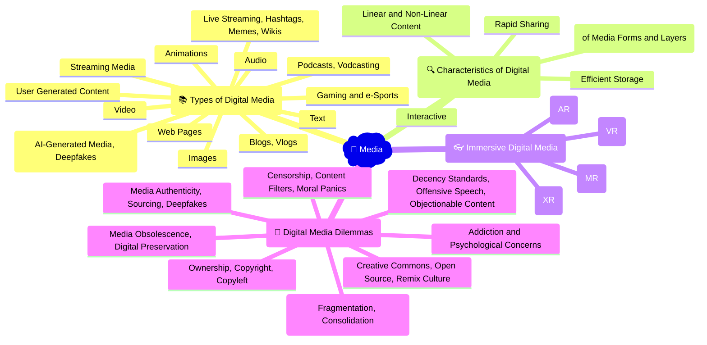

## Video explainer

## Mindmap

```mermaid

mindmap
	)📱 Media(
		(📚 Types of Digital Media)
			Text
			Images
			Audio
			Animations
			Video
			Web Pages
			Gaming and e-Sports
			Blogs, Vlogs
			Podcasts, Vodcasting
			Live Streaming, Hashtags, Memes, Wikis
			Streaming Media
			User Generated Content
			Synthetic Digital Media (AI-Generated Media, Deepfakes)
		(🔍 Characteristics of Digital Media)
			Rapid Sharing
			Efficient Storage
			Interactive
			Linear and Non-Linear Content
			Convergence (of Media Forms and Layers)
		(👓 Immersive Digital Media)
			Augmented Reality (AR)
			Virtual Reality (VR)
			Mixed Reality (MR)
			X Reality (XR)
		(🚫 Digital Media Dilemmas)
			Addiction and Psychological Concerns
			Impact on Journalism (Fragmentation, Consolidation)
			Media Authenticity, Sourcing, Deepfakes
			Ownership, Copyright, Copyleft
			Creative Commons, Open Source, Remix Culture
			Media Obsolescence, Digital Preservation
			Censorship, Content Filters, Moral Panics
			Decency Standards, Offensive Speech, Objectionable Content
```

## Flashcards

<iframe src="https://quizlet.com/854059503/learn/embed?i=26rc5y&x=1jj1" height="500" width="100%"></iframe>

