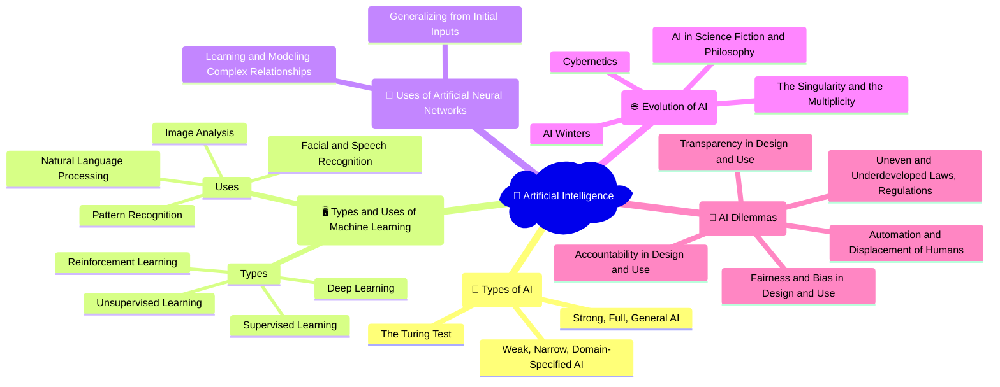

## Video explainer

## Mindmap

```mermaid

mindmap
	)🤖 Artificial Intelligence(
		(🔄 Types of AI)
			Strong, Full, General AI
			Weak, Narrow, Domain-Specified AI
			The Turing Test
		(🖥️ Types and Uses of Machine Learning)
			Types
				Supervised Learning
				Unsupervised Learning
				Reinforcement Learning
				Deep Learning
			Uses
				Pattern Recognition
				Facial and Speech Recognition
				Image Analysis
				Natural Language Processing
		(🧠 Uses of Artificial Neural Networks)
			Learning and Modeling Complex Relationships
			Generalizing from Initial Inputs
		(🌐 Evolution of AI)
			AI in Science Fiction and Philosophy
			Cybernetics
			AI Winters
			The Singularity and the Multiplicity
		(🚫 AI Dilemmas)
			Fairness and Bias in Design and Use
			Accountability in Design and Use
			Transparency in Design and Use
			Uneven and Underdeveloped Laws, Regulations
			Automation and Displacement of Humans
```

## Flashcards

<iframe src="https://quizlet.com/854378089/learn/embed?i=26rc5y&x=1jj1" height="500" width="100%"></iframe>

