## 🎬 Video playlist

<iframe width="560" height="315" src="https://www.youtube.com/embed/videoseries?si=phm7HlgB2skre-1z&amp;list=PL4UlCwuOc83nKwN7_52hPQHyCXOjZd4Tt" title="YouTube video player" frameborder="0" allow="accelerometer; autoplay; clipboard-write; encrypted-media; gyroscope; picture-in-picture; web-share" referrerpolicy="strict-origin-when-cross-origin" allowfullscreen></iframe>

## 🤯 Mindmap

```mermaid

mindmap
	)🤖 Artificial Intelligence(
		(🔄 Types of AI)
			Strong, Full, General AI
			Weak, Narrow, Domain-Specified AI
			The Turing Test
		(🖥️ Types and Uses of Machine Learning)
			Types
				Supervised Learning
				Unsupervised Learning
				Reinforcement Learning
				Deep Learning
			Uses
				Pattern Recognition
				Facial and Speech Recognition
				Image Analysis
				Natural Language Processing
		(🧠 Uses of Artificial Neural Networks)
			Learning and Modeling Complex Relationships
			Generalizing from Initial Inputs
		(🌐 Evolution of AI)
			AI in Science Fiction and Philosophy
			Cybernetics
			AI Winters
			The Singularity and the Multiplicity
		(🚫 AI Dilemmas)
			Fairness and Bias in Design and Use
			Accountability in Design and Use
			Transparency in Design and Use
			Uneven and Underdeveloped Laws, Regulations
			Automation and Displacement of Humans
```

## 🧠 Flashcards

<iframe src="https://quizlet.com/854378089/learn/embed?i=26rc5y&x=1jj1" height="500" width="100%"></iframe>

## 📝 Notes

### Types of AI
- **Strong, Full, General AI**: Artificial intelligence that can think and reason like a human, with the ability to perform any intellectual task that a human can.
- **Weak, Narrow, Domain-Specified AI**: AI designed to perform specific tasks or operate within a limited domain, lacking the versatility of human intelligence.
  - **Domain-Specified AI**: AI trained to excel in a specific area, such as playing chess or recognizing speech.
- **The Turing Test**: A test proposed by Alan Turing to determine whether a machine can exhibit intelligent behavior indistinguishable from that of a human.

### Types and Uses of Machine Learning
- **Types**:
  - **Supervised Learning**: A type of machine learning where the algorithm learns from labeled data, using input-output pairs to make predictions or decisions.
    - **Classification**: The task of assigning input data to predefined categories or classes.
    - **Regression**: The task of predicting a continuous value based on input data.
  - **Unsupervised Learning**: A type of machine learning where the algorithm learns from unlabeled data, discovering patterns or structures without explicit guidance.
    - **Clustering**: The task of grouping similar data points together based on their inherent characteristics.
    - **Dimensionality Reduction**: The process of reducing the number of variables or features in a dataset while retaining important information.
  - **Reinforcement Learning**: A type of machine learning where an agent learns to make decisions by interacting with an environment, receiving rewards or punishments for its actions.
  - **Deep Learning**: A subset of machine learning that uses artificial neural networks with multiple layers to learn and represent complex patterns in data.
- **Uses**:
  - **Pattern Recognition**: Identifying and classifying patterns in data, such as images, sounds, or text.
  - **Facial and Speech Recognition**: Identifying individuals based on their facial features or voice characteristics.
  - **Image Analysis**: Extracting meaningful information from digital images, such as object detection or scene understanding.
  - **Natural Language Processing**: Enabling machines to understand, interpret, and generate human language.
    - **Sentiment Analysis**: Determining the emotional tone or opinion expressed in a piece of text.
    - **Machine Translation**: Automatically translating text from one language to another.

### Uses of Artificial Neural Networks
- **Learning and Modeling Complex Relationships**: ANNs can learn and represent intricate patterns and relationships in data, making them suitable for tasks such as image recognition or natural language processing.
- **Generalizing from Initial Inputs**: ANNs can generalize from the examples they are trained on, enabling them to make predictions or decisions on new, unseen data.

### Evolution of AI
- **AI in Science Fiction and Philosophy**: The exploration of artificial intelligence in literature, film, and philosophical discussions, often shaping public perception and expectations of AI.
- **Cybernetics**: The study of control and communication in living organisms and machines, laying the foundation for the development of AI.
- **AI Winters**: Periods of reduced funding and interest in AI research, often following a phase of hype and disappointment.
- **The Singularity**: A hypothetical future point at which artificial intelligence surpasses human intelligence, potentially leading to rapid technological growth and unpredictable changes.
- **The Multiplicity**: An alternative view to the Singularity, suggesting that AI will develop in diverse ways, with multiple specialized intelligences rather than a single, dominant AI.

### AI Dilemmas
- **Fairness and Bias in Design and Use**: The potential for AI systems to perpetuate or amplify biases present in the data they are trained on or the people who design them.
  - **Algorithmic Bias**: Systematic errors or discriminatory outcomes resulting from flawed algorithms or biased training data.
- **Accountability in Design and Use**: Determining who is responsible for the actions and decisions made by AI systems, especially in cases of harm or unintended consequences.
- **Transparency in Design and Use**: The challenge of making AI systems' decision-making processes and reasoning transparent and understandable to users and stakeholders.
  - **Explainable AI**: Developing AI systems that can provide clear explanations for their decisions and actions.
- **Uneven and Underdeveloped Laws, Regulations**: The lack of comprehensive legal and regulatory frameworks to govern the development and use of AI technologies.
  - **Ethical Guidelines**: The need for established principles and best practices to guide the responsible development and deployment of AI.
- **Automation and Displacement of Humans**: The potential for AI and automation to replace human workers in various industries, leading to job losses and economic disruption.
  - **Skill Shift**: The changing nature of work and the need for humans to develop new skills to work alongside AI systems.
  - **Universal Basic Income**: The idea of providing a guaranteed income to all citizens to mitigate the impact of AI-driven job displacement.

