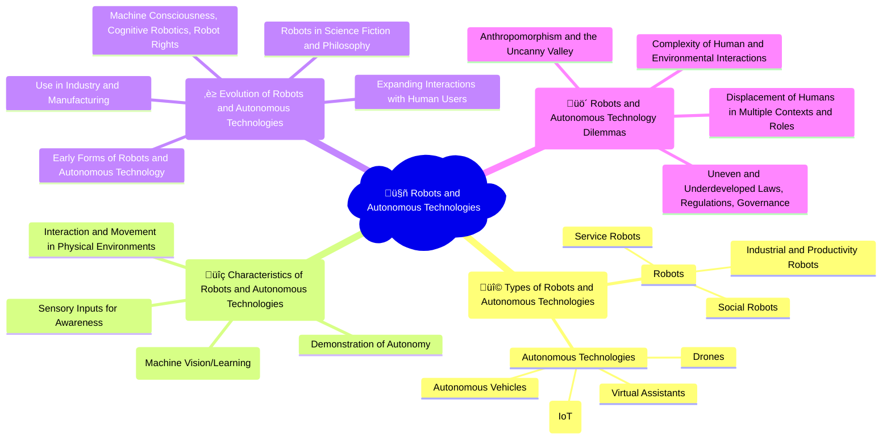

## Video explainer

## Mindmap

## Flashcards

<iframe src="https://quizlet.com/854378089/learn/embed?i=26rc5y&x=1jj1" height="500" width="100%"></iframe>

## Notes

### Types of Robots and Autonomous Technologies
- **Robots**: Machines designed to carry out complex tasks automatically or with varying degrees of human control.
  - **Industrial and Productivity Robots**: Robots used in manufacturing and production settings to perform repetitive or dangerous tasks, such as assembly line work or material handling.
  - **Service Robots**: Robots designed to assist humans in various settings, such as healthcare, education, or customer service.
    - **Surgical Robots**: Robots used to assist in medical procedures, providing greater precision and minimally invasive techniques.
    - **Educational Robots**: Robots used in teaching and learning environments to engage students and facilitate hands-on learning experiences.
  - **Social Robots**: Robots designed to interact with humans in social settings, providing companionship, entertainment, or emotional support.
    - **Companion Robots**: Robots designed to provide social interaction and assistance to individuals, particularly the elderly or those with special needs.
    - **Entertainment Robots**: Robots used for leisure activities, such as dancing, singing, or playing games.
- **Autonomous Technologies**: Systems that can operate independently, making decisions and taking actions without direct human control.
  - **Internet of Things (IoT)**: The network of interconnected devices, sensors, and everyday objects that can collect and exchange data over the internet.
    - **Smart Homes**: Residential environments equipped with connected devices and systems that can be controlled and automated remotely.
    - **Wearables**: Devices worn on the body that can track and monitor personal data, such as fitness trackers or smartwatches.
  - **Autonomous Vehicles**: Vehicles that can navigate and operate without human intervention, using sensors, cameras, and artificial intelligence.
    - **Self-Driving Cars**: Automobiles equipped with autonomous driving systems that can handle all aspects of the driving task.
    - **Autonomous Delivery Robots**: Robots designed to transport goods or packages without human intervention, often used for last-mile delivery.
  - **Drones**: Unmanned aerial vehicles (UAVs) that can fly autonomously or be remotely controlled, used for a variety of purposes such as aerial photography, surveillance, or delivery.
  - **Virtual Assistants**: Software agents that can understand and respond to voice commands or text input, assisting users with tasks such as scheduling, information retrieval, or home automation.

### Characteristics of Robots and Autonomous Technologies
- **Sensory Inputs for Awareness**: The ability to gather and process information from the environment through sensors, such as cameras, microphones, or touch sensors.
- **Logical Reasoning with Inputs**: The capacity to analyze and interpret sensory data using machine vision, machine learning, or other AI techniques to make decisions and take actions.
- **Interaction and Movement in Physical Environments**: The capability to navigate, manipulate objects, and interact with the physical world, either through pre-programmed behaviors or adaptive learning.
- **Demonstration of Autonomy**: The ability to operate independently, making decisions and solving problems without constant human intervention or control.

### Evolution of Robots and Autonomous Technologies
- **Early Forms of Robots and Autonomous Technology**: The historical development of automated machines and early attempts at creating self-operating systems.
- **Robots in Science Fiction and Philosophy**: The portrayal and exploration of robots and autonomous technologies in literature, film, and philosophical discussions, shaping public perception and inspiring technological advancements.
- **Use in Industry and Manufacturing**: The widespread adoption of robots and automation in industrial settings to improve efficiency, productivity, and safety.
- **Expanding Interactions with Human Users**: The growing presence of robots and autonomous systems in various aspects of daily life, such as healthcare, education, and personal assistance.
- **Machine Consciousness, Cognitive Robotics, Robot Rights**: The ongoing research and debate surrounding the possibility of machines achieving self-awareness, human-like cognition, and the ethical considerations of granting rights to intelligent machines.

### Robots and Autonomous Technology Dilemmas
- **Anthropomorphism and the Uncanny Valley**: The tendency to attribute human characteristics to robots and the psychological discomfort that can arise when robots appear almost, but not quite, human-like.
- **Complexity of Human and Environmental Interactions**: The challenges of designing robots and autonomous systems that can effectively navigate the intricacies of human social interactions and unpredictable real-world environments.
- **Uneven and Underdeveloped Laws, Regulations, Governance**: The lack of comprehensive legal and regulatory frameworks to address the unique challenges posed by robots and autonomous technologies, such as liability, privacy, and safety concerns.
- **Displacement of Humans in Multiple Contexts and Roles**: The potential for robots and automation to replace human workers in various industries and occupations, leading to job losses and economic disruption.
  - **Skill Shift**: The changing nature of work and the need for humans to develop new skills to work alongside robots and autonomous systems.
  - **Universal Basic Income**: The idea of providing a guaranteed income to all citizens to mitigate the impact of robot-driven job displacement.
- **Ethical Considerations**: The moral and ethical implications of delegating decision-making to autonomous systems, particularly in situations with life-or-death consequences.
  - **Responsibility and Accountability**: Determining who is liable or responsible for the actions and decisions made by robots and autonomous technologies.
  - **Bias and Fairness**: Ensuring that the algorithms and data used to train robots and autonomous systems do not perpetuate or amplify societal biases or discrimination.
