## Mindmap

```mermaid
mindmap
  root)🎨 4.1 Cultural(
    Arts, Entertainment and Popular Culture{{🎭 Arts, Entertainment and Popular Culture}}
      (Genres, Techniques and Forms)
        [Digital art]
        [Virtual reality experiences]
        [Interactive installations]
      (Ways to Experience Art and Entertainment) 
        [Online galleries]
        [Streaming platforms]
      (Memes, Online Forums, Internet Celebrities)
        [Social media platforms]
        [Online communities]
    Home, Leisure and Tourism{{🏡 Home, Leisure and Tourism}}
      (Home Appliances, Services and Technologies)
        [Smart home devices]
        [Home automation systems]
      (Sports, Gaming and Hobbies)
        [Esports tournaments]
        [Online gaming communities]
        [Virtual reality sports experiences]  
      (Travel, Sharing Platforms and Tourism)
        [Online travel booking]
        [Virtual tourism experiences]
    Heritage, Customs and Celebrations{{🏛️ Heritage, Customs and Celebrations}}  
      (Rites of Passage)
        [Virtual weddings]
        [Online graduation ceremonies]
      (Cultural Heritage, Customs and Celebrations)
        [Digital archives]
        [Virtual museums] 
        [Online cultural events]
    Subcultures{{👥 Subcultures}}
      (Youth Cultures)
        [Social media trends]
        [Online fan communities]
      (Online Communities and Forums)
        [Reddit]
        [Discord]
        [Facebook Groups]
```

## Notes

### 🎭 4.1A Arts, entertainment and popular culture

| Subtopic | Examples of uses | Positive impacts | Negative impacts |
|----------|------------------|------------------|------------------|
| 🎨 Genres, techniques and forms | - Digital art (Adobe Creative Cloud, Procreate, Rebelle)   - Virtual reality experiences (Tilt Brush, Oculus Quill, Google Tilt Brush)   - Interactive installations (teamLab, Random International) | - Increased accessibility to art   - New forms of creative expression | - Potential for copyright infringement   - Loss of traditional art forms |
| 👀 Ways to experience art and entertainment | - Online galleries ([Google Arts & Culture](https://artsandculture.google.com/), [Artsy](https://www.artsy.net/), [Rhizome](https://rhizome.org/))   - Streaming platforms ([Netflix](https://www.netflix.com/), [Spotify](https://www.spotify.com/), [Hulu](https://www.hulu.com/)) | - Wider access to art and entertainment   - Personalized recommendations | - Dependence on technology   - Reduced support for local artists and venues |
| 💻 Memes, online forums, internet celebrities and influencers | - Social media platforms ([Instagram](https://www.instagram.com/), [TikTok](https://www.tiktok.com/), [YouTube](https://www.youtube.com/))   - Online communities ([Reddit](https://www.reddit.com/), [Imgur](https://imgur.com/)) | - Rapid spread of ideas and trends   - New forms of entertainment and communication | - Spread of misinformation   - Negative influence on mental health and self-image |

### 🏡 4.1B Home, leisure and tourism  

| Subtopic | Examples of uses | Positive impacts | Negative impacts |
|----------|------------------|------------------|------------------|
| 🏠 Home appliances, services and technologies | - Smart home devices ([Amazon Echo](https://www.amazon.com/Echo-And-Alexa-Devices/b?ie=UTF8&node=9818047011), [Google Home](https://store.google.com/product/google_home), [Apple HomePod](https://www.apple.com/homepod/))   - Home automation systems ([Control4](https://www.control4.com/), [Crestron](https://www.crestron.com/en-US/Home-Automation), [Savant](https://www.savant.com/)) | - Increased convenience and energy efficiency   - Improved accessibility for people with disabilities | - Privacy concerns   - Dependence on technology   - Potential for hacking and security breaches |
| 🎮 Sports, gaming and hobbies | - Esports tournaments ([League of Legends World Championship](https://www.lolesports.com/), [The International](https://www.dota2.com/majors/ti8), [Overwatch League](https://overwatchleague.com/))   - Online gaming communities ([Steam](https://store.steampowered.com/), [Xbox Live](https://www.xbox.com/en-US/live), [PlayStation Network](https://www.playstation.com/en-us/network/))   - Virtual reality sports experiences ([FitXR](https://www.fitxr.com/), [Zwift](https://www.zwift.com/)) | - Increased accessibility and global connectivity   - New forms of competition and collaboration | - Addiction   - Sedentary lifestyle   - Cyberbullying and toxic behavior | 
| 🧳 Travel, sharing platforms and tourism | - Online travel booking ([Expedia](https://www.expedia.com/), [Airbnb](https://www.airbnb.com/), [Booking.com](https://www.booking.com/))   - Virtual tourism experiences ([Atlas Obscura](https://www.atlasobscura.com/), [Google Earth](https://earth.google.com/web/), [YouVisit](https://www.youvisit.com/)) | - Easier trip planning and booking   - Access to local experiences and accommodations | - Overcrowding in popular destinations   - Negative impact on local communities and economies |

### 🏛️ 4.1C Heritage, customs and celebrations

| Subtopic | Examples of uses | Positive impacts | Negative impacts |
|----------|------------------|------------------|------------------|
| 💍 Rites of passage | - Virtual weddings ([Wedfuly](https://wedfuly.com/), [VirtualWeddings.com](https://virtualweddings.com/))   - Online graduation ceremonies ([GradSource](https://www.gradsource.com/))  | - Increased accessibility for distant family and friends   - Reduced costs and environmental impact | - Loss of traditional rituals and social connections   - Technical difficulties and disruptions |
| 🌍 Expression and preservation of cultural heritage, customs and celebrations | - Digital archives ([Google Arts & Culture](https://artsandculture.google.com/), [Europeana](https://www.europeana.eu/))   - Virtual museums ([Louvre](https://www.louvre.fr/en/online-tours), [British Museum](https://www.britishmuseum.org/visit/virtual-tours))   - Online cultural events ([CultureHub](https://www.culturehub.org/)) | - Wider access to cultural heritage   - Preservation of endangered customs and traditions | - Potential for cultural appropriation   - Loss of context and authenticity |  

### 👥 4.1D Subcultures

| Subtopic | Examples of uses | Positive impacts | Negative impacts |
|----------|------------------|------------------|------------------|
| 👦 Youth cultures | - Social media trends (TikTok challenges, Instagram influencers)   - Online fan communities ([Wattpad](https://www.wattpad.com/), [AO3](https://archiveofourown.org/), [Tumblr](https://www.tumblr.com/)) | - Increased self-expression and connection with like-minded individuals   - New forms of creativity and activism | - Peer pressure   - Exclusion and discrimination   - Exposure to inappropriate content |
| 💬 Online communities and forums | - [Reddit](https://www.reddit.com/)   - [Discord](https://discord.com/)   - [Facebook Groups](https://www.facebook.com/groups/) | - Support and information sharing   - Formation of new social connections and identities | - Echo chambers   - Radicalization and extremism   - Cyberbullying and harassment |