## Mindmap

```mermaid
mindmap
  root)💰 4.2 Economic(
    Business{{🏢 Business}}
      (Operation and Organization)
        [Cloud computing]
        [Customer Databases]
      (Diversity in Businesses)
        [Diversity and inclusion initiatives]
        [Unconscious bias training]
    Employment and Labour{{👷 Employment and Labour}}
      (Working Practices)
        [Remote work tools]
        [Digital nomadism]
        [Open office designs]
      (Crowd Work and Gig Economies)
        [Freelance platforms]
        [Ride-sharing apps]
        [Delivery services]
      (Automation and Employment)
        [AI-powered chatbots]
        [Self-driving vehicles]
    Goods, Services and Currencies{{🛒 Goods, Services and Currencies}}
      (E-commerce and Online Marketplaces)
        [Amazon]
        [eBay]
        [Alibaba]
        [Etsy]
      (Personalized and Targeted Marketing)
        [Behavioral targeting]
        [Geotargeting]
        [Predictive analytics]
      (Cryptocurrencies, NFTs, and Cashless Society)
        [Bitcoin]
        [Ethereum]
        [NFT marketplaces]
        [Mobile payment apps]
      (Additive Manufacturing)
        [3D printing]
        [Rapid prototyping]
        [Customized production]
    Globalization{{🌐 Globalization}}
      (Borderless Selling and Global Sourcing)
        [Cross-border e-commerce]
        [Global supply chain management]
        [International payment systems]

```

## Notes

### 🏢 4.2A Business

| Subtopic | Examples of uses | Positive impacts | Negative impacts |
|----------|------------------|------------------|------------------|
| 🖥️ Operation and organization of businesses | - Cloud computing ([AWS](https://aws.amazon.com/), [Microsoft Azure](https://azure.microsoft.com/), [Google Cloud](https://cloud.google.com/))   - Enterprise resource planning (ERP) systems ([SAP](https://www.sap.com/products/enterprise-management-erp.html), [Oracle ERP](https://www.oracle.com/erp/), [Microsoft Dynamics](https://dynamics.microsoft.com/en-us/))   - Customer relationship management (CRM) software ([Salesforce](https://www.salesforce.com/), [HubSpot](https://www.hubspot.com/), [Zoho CRM](https://www.zoho.com/crm/)) | - Increased efficiency, collaboration, and data-driven decision making | - Dependence on technology   - Potential for data breaches and privacy violations |
| 🌈 Diversity in businesses and corporations | - Digital diversity and inclusion initiatives ([Microsoft's GCDI](https://www.microsoft.com/en-us/corporate-responsibility/skills-employability/partners), [Accenture's Inclusion & Diversity](https://www.accenture.com/us-en/about/inclusion-diversity))   - Online employee resource groups ([Microsoft Disability Employee Resource Group](https://www.microsoft.com/en-us/diversity/inside-microsoft/cross-company-strategic-initiatives/employee-resource-groups.aspx), [Google's Pride @ Google](https://www.google.com/get/employeeresourcegroups/pride/))   - Virtual unconscious bias training ([Google's Unbiasing](https://rework.withgoogle.com/subjects/unbiasing/), [Microsoft's Unconscious Bias Training](https://www.microsoft.com/en-us/diversity/inside-microsoft/cross-company-strategic-initiatives/awareness-and-training.aspx)) | - Leveraging technology to increase diversity and inclusion   - Improved sense of community and support for underrepresented groups   - Raising awareness and addressing biases in digital spaces | - Tokenism and superficial efforts   - Lack of tangible change and progress   - Potential for online harassment and discrimination |  

🗞️ **News item**: Microsoft has pledged to invest $150 million in diversity and inclusion initiatives, including increasing the number of Black and African American managers and senior employees by 2025. ([Source](https://blogs.microsoft.com/blog/2020/06/23/microsoft-audits-reveal-an-additional-201000-annual-overpaid-wages-for-employees-in-the-u-s-along-with-the-release-of-latest-diversity-data/))

### 👷 4.2B Employment and labour

| Subtopic | Examples of uses | Positive impacts | Negative impacts |
|----------|------------------|------------------|------------------|
| 💻 Working practices | - Remote work tools ([Zoom](https://zoom.us/), [Slack](https://slack.com/), [Microsoft Teams](https://www.microsoft.com/en-us/microsoft-teams/group-chat-software))   - Digital nomadism ([Remote Year](https://remoteyear.com/), [Hacker Paradise](https://www.hackerparadise.org/))   - Open office designs ([WeWork](https://www.wework.com/), [Regus](https://www.regus.com/)) | - Increased flexibility   - Work-life balance   - Access to global talent pool | - Isolation   - Communication challenges   - Blurred boundaries between work and personal life |
| 🕴️ Crowd work, microwork and gig economies | - Freelance platforms ([Upwork](https://www.upwork.com/), [Fiverr](https://www.fiverr.com/), [Freelancer](https://www.freelancer.com/))   - Ride-sharing apps ([Uber](https://www.uber.com/), [Lyft](https://www.lyft.com/))   - Delivery services ([DoorDash](https://www.doordash.com/), [Instacart](https://www.instacart.com/)) | - Increased job opportunities   - Flexibility   - Low barriers to entry | - Lack of benefits and job security   - Exploitation of workers   - Income instability |
| 🤖 Automation and employment | - Robotic process automation (RPA) ([UiPath](https://www.uipath.com/), [Automation Anywhere](https://www.automationanywhere.com/), [Blue Prism](https://www.blueprism.com/))   - AI-powered chatbots ([IBM Watson Assistant](https://www.ibm.com/cloud/watson-assistant/), [Amazon Lex](https://aws.amazon.com/lex/), [DialogFlow](https://cloud.google.com/dialogflow))   - Self-driving vehicles ([Waymo](https://waymo.com/), [Cruise](https://www.getcruise.com/), [Tesla](https://www.tesla.com/autopilotAI)) | - Increased productivity   - Reduced errors and costs | - Job displacement   - Skill gap   - Widening income inequality |

🗞️ **News item**: A study by the World Economic Forum estimates that by 2025, automation could displace 85 million jobs while creating 97 million new ones, emphasizing the need for upskilling and reskilling workers. ([Source](https://www.weforum.org/reports/the-future-of-jobs-report-2020))

### 🛒 4.2C Goods, services and currencies

| Subtopic | Examples of uses | Positive impacts | Negative impacts |
|----------|------------------|------------------|------------------|
| 🛍️ E-commerce, e-trading and online marketplaces | - [Amazon](https://www.amazon.com/)   - [eBay](https://www.ebay.com/)   - [Alibaba](https://www.alibaba.com/)   - [Etsy](https://www.etsy.com/) | - Increased convenience   - Wider product selection   - Access to global markets | - Disruption of traditional retail   - Counterfeit products   - Environmental impact of shipping |
| 🎯 Personalized and targeted marketing | - Behavioral targeting ([Facebook Ads](https://www.facebook.com/business/ads), [Google Ads](https://ads.google.com/))   - Geotargeting ([Foursquare](https://foursquare.com/), [Snapchat Geofilters](https://www.snapchat.com/ads))   - Predictive analytics ([SAS](https://www.sas.com/en_us/software/customer-intelligence-suite.html), [IBM SPSS](https://www.ibm.com/products/spss-predictive-analytics)) | - Improved customer experience   - Increased conversions and loyalty | - Invasion of privacy   - Data exploitation   - Algorithmic bias |
| 💰 Cryptocurrency, non-fungible tokens (NFTs), cashless society and micro-transactions | - [Bitcoin](https://bitcoin.org/en/)   - [Ethereum](https://ethereum.org/)   - NFT marketplaces ([OpenSea](https://opensea.io/), [Nifty Gateway](https://niftygateway.com/))   - Mobile payment apps ([Venmo](https://venmo.com/), [Cash App](https://cash.app/)) | - Increased financial inclusion   - Lower transaction fees   - New forms of digital ownership | - Volatility   - Lack of regulation   - Potential for fraud and money laundering |
| 👷 Additive manufacturing | - 3D printing ([Stratasys](https://www.stratasys.com/), [3D Systems](https://www.3dsystems.com/), [Formlabs](https://formlabs.com/))   - Rapid prototyping   - Customized production | - Faster product development   - Reduced waste   - Localized manufacturing | - Intellectual property concerns   - Quality control issues   - Potential for misuse (e.g., 3D-printed weapons) |

🗞️ **News item**: The NFT artwork "Everydays: The First 5000 Days" by digital artist Beeple sold for $69.3 million at Christie's auction house, setting a new record for digital art sales. ([Source](https://www.christies.com/features/Monumental-collage-by-Beeple-is-first-purely-digital-artwork-NFT-to-come-to-auction-11630/))

### 🌐 4.2D Globalization

| Subtopic | Examples of uses | Positive impacts | Negative impacts |
|----------|------------------|------------------|------------------|
| 🌍 Borderless selling and global sourcing | - Cross-border e-commerce ([Alibaba](https://www.alibaba.com/), [Amazon Global Selling](https://services.amazon.com/global-selling.html))   - Global supply chain management ([SAP Supply Chain Management](https://www.sap.com/products/supply-chain-management.html), [Oracle Supply Chain Management](https://www.oracle.com/scm/))   - International payment systems ([PayPal](https://www.paypal.com/), [Wise](https://wise.com/)) | - Increased market access   - Lower prices for consumers   - Economic growth | - Exploitation of labor in developing countries   - Environmental degradation   - Cultural homogenization |
| 🌎 Offshoring, outsourcing, reshoring, inshoring, and insourcing | - Business process outsourcing (BPO) ([Accenture](https://www.accenture.com/us-en/services/business-process-outsourcing-index), [Infosys](https://www.infosys.com/services/business-process-outsourcing.html))   - Knowledge process outsourcing (KPO) ([Wipro](https://www.wipro.com/services/knowledge-process-outsourcing/), [Genpact](https://www.genpact.com/))   - Nearshoring ([Softtek](https://www.softtek.com/), [Globant](https://www.globant.com/)) | - Cost savings   - Access to specialized skills   - Increased competitiveness | - Job losses in home countries   - Communication and cultural barriers   - Quality control issues |

🗞️ **News item**: The COVID-19 pandemic has accelerated the trend of reshoring and nearshoring, as companies seek to reduce their reliance on distant suppliers and improve supply chain resilience. ([Source](https://www.forbes.com/sites/harrybradshaw/2020/08/28/how-reshoring-and-nearshoring-are-getting-manufacturing-closer-to-home/))