## Mindmap

```mermaid
mindmap
  root)♻️ 4.3 Environmental(
    Natural Resources and Ecosystems{{🌳 Natural Resources and Ecosystems}}
      (Natural Resource Use and Distribution)
        [Fairphone]
        [Dell's closed-loop recycling]
        [Tesla's electric vehicles]
      (Ecosystem and Biodiversity Protection)
        [Wildlife conservation drones]
        [Global Forest Watch]
        [iNaturalist]
      (Natural Events and Disasters)
        [Google Earth Engine]
        [Pacific Disaster Center's DisasterAWARE]
        [NASA's Disasters Program]
    Pollution and Waste{{💨 Pollution and Waste}}
      (Recycling and Waste Management)
        [Rubicon Global]
        [Litterati]
        [TerraCycle]
      (Types of Pollution)
        [PurpleAir]
        [Swim Guide]
        [Light Pollution Map]
      (Green Computing and E-waste)
        [EPEAT]
        [Apple's Daisy]
        [iFixit]
    Cities, Infrastructures and Built Environments{{🏙️ Cities, Infrastructures and Built Environments}}
      (Urban Spaces and Cities)
        [Sidewalk Labs]
        [CityMapper]
        [ParkMobile]
      (Local and Regional Infrastructures)
        [IBM Intelligent Water]
        [Siemens' Smart Grid]
        [Cisco's Connected Communities]
      (Transportation and Wayfinding)
        [Google Maps]
        [Waze]
        [Uber]
        [Lime]
    Agriculture{{🌾 Agriculture}}
      (Agricultural Production and Distribution)
        [John Deere's Precision Ag Technology]
        [Indigo Ag]
        [FarmBot]
```

## Notes

### 🌳 4.3A Natural resources and ecosystems

| Subtopic | Examples of uses | Positive impacts | Negative impacts |
|----------|------------------|------------------|------------------|
| 💠Use and distribution of natural resources, including in digital systems and devices | - [Fairphone](https://www.fairphone.com/) (sustainable smartphone)   - [Dell's closed-loop recycling program](https://www.dell.com/learn/us/en/uscorp1/corp-comm/circular-economy)   - [Tesla's electric vehicles](https://www.tesla.com/) | - Increased awareness of resource consumption   - Promotion of circular economy | - Continued extraction of finite resources   - E-waste generation |
| 🦋 Protection and threats to ecosystems and biodiversity | - [Wildlife conservation drones](https://www.nationalparkservice.gov/articles/000/drones-conservation.htm)   - [Global Forest Watch](https://www.globalforestwatch.org/) (deforestation monitoring)   - [iNaturalist](https://www.inaturalist.org/) (citizen science platform) | - Enhanced monitoring and protection of ecosystems   - Increased public engagement | - Potential for data misuse   - Disturbance to wildlife |
| 🌪️ Natural events and disasters | - [Google Earth Engine](https://earthengine.google.com/) (satellite imagery analysis)   - [Pacific Disaster Center's DisasterAWARE platform](https://www.pdc.org/apps/disasteraware/)   - [NASA's Disasters Program](https://disasters.nasa.gov/) | - Improved disaster response and preparedness   - Increased public awareness | - Overreliance on technology   - Potential for data inaccuracies |

🗞️ **News item**: The Global Forest Watch platform, developed by the World Resources Institute, uses satellite imagery and AI to track deforestation in real-time, enabling governments and organizations to take action against illegal logging. ([Source](https://www.wri.org/insights/numbers/two-revivals-shook-world-illegal-logging-2022))

### 💨 4.3B Pollution and waste

| Subtopic | Examples of uses | Positive impacts | Negative impacts |
|----------|------------------|------------------|------------------|
| ♻️ Recycling and waste management | - [Rubicon Global](https://www.rubiconglobal.com/) (waste management software)   - [Litterati](https://www.litterati.org/) (litter tracking app)   - [TerraCycle](https://www.terracycle.com/) (recycling solutions) | - Increased efficiency in waste management   - Promotion of recycling and upcycling | - Potential for greenwashing   - Continued generation of waste |
| 🭠Types of pollution, including air, water, solid, noise and light pollution | - [PurpleAir](https://www.purpleair.com/) (air quality monitoring)   - [Swim Guide](https://www.swimguide.org/) (water quality information)   - [Light Pollution Map](https://www.lightpollutionmap.info/) (light pollution tracking) | - Increased public awareness of pollution   - Data-driven policy making | - Potential for data inaccuracies   - Limited impact on pollution reduction |
| 💻 Green computing, e-waste, planned obsolescence | - [EPEAT](https://greenelectronicscouncil.org/epeat/epeat-overview/) (green electronics rating system)   - [Apple's Daisy](https://www.apple.com/newsroom/2018/04/apple-offers-new-environmental-way-to-dispose-of-plastics/) (iPhone disassembly robot)   - [iFixit](https://www.ifixit.com/) (repair guides and tools) | - Promotion of energy-efficient and recyclable electronics   - Increased device longevity | - Continued generation of e-waste   - Limited adoption of sustainable practices |

🗞️ **News item**: Apple's recycling robot, Daisy, can disassemble up to 200 iPhones per hour, recovering valuable materials like cobalt, aluminum, and rare earth elements for reuse in new products. ([Source](https://www.apple.com/newsroom/2018/04/apple-offers-new-environmental-way-to-dispose-of-plastics/))

### 🏙️ 4.3C Cities, infrastructures and built environments

| Subtopic | Examples of uses | Positive impacts | Negative impacts |
|----------|------------------|------------------|------------------|
| 🌆 Design and use of urban spaces and cities | - [Sidewalk Labs](https://www.sidewalklabs.com/) (smart city development)   - [CityMapper](https://citymapper.com/) (urban navigation app)   - [ParkMobile](https://parkmobile.io/) (smart parking solutions) | - Increased livability and sustainability of cities   - Data-driven urban planning | - Concerns about privacy and data ownership   - Potential for social inequity |
| ğŸ—ï¸ Local and regional infrastructures | - [IBM Intelligent Water](https://www.ibm.com/products/ibm-intelligent-water) (water management system)   - [Siemens' Smart Grid](https://new.siemens.com/global/en/products/energy/energy-automation-and-smart-grid.html) (energy management)   - [Cisco's Connected Communities](https://www.cisco.com/c/en/us/solutions/industries/smart-connected-communities.html) (smart city infrastructure) | - Improved efficiency and resilience of infrastructure   - Reduced resource consumption | - High implementation costs   - Potential for system vulnerabilities |
| 🚘 Transportation and wayfinding, maps, global positioning systems (GPS) and geographic information systems (GIS) | - [Google Maps](https://www.google.com/maps)   - [Waze](https://www.waze.com/) (real-time traffic navigation)   - [Uber](https://www.uber.com/) (ride-sharing)   - [Lime](https://www.li.me/) (micromobility) | - Increased convenience and efficiency of transportation   - Reduced congestion | - Concerns about data privacy   - Impact on public transit and urban planning |

🗞️ **News item**: Sidewalk Labs, a subsidiary of Alphabet (Google's parent company), has proposed the development of a smart city in Toronto, Canada, featuring autonomous vehicles, adaptive traffic signals, and sensor-equipped buildings to optimize energy use and livability. ([Source](https://www.sidewalklabs.com/))

### 🌾 4.3D Agriculture

| Subtopic | Examples of uses | Positive impacts | Negative impacts |
|----------|------------------|------------------|------------------|
| 🚜 Agricultural production and distribution | - [John Deere's Precision Ag Technology](https://www.deere.com/en/technology-products/precision-ag-technology/) (smart farming equipment)   - [Indigo Ag](https://www.indigoag.com/) (data-driven agronomy)   - [FarmBot](https://farm.bot/) (open-source farming robot) | - Increased crop yields   - Reduced water and pesticide use   - Improved soil health | - High cost of adoption   - Potential for data misuse   - Impact on small-scale farmers |

🗞️ **News item**: Indigo Ag, a Massachusetts-based startup, uses satellite imagery, machine learning, and microbial seed treatments to help farmers optimize crop yields and reduce the environmental impact of agriculture. ([Source](https://www.indigoag.com/))