## Mindmap

```mermaid
mindmap
  root)💊 4.4 Health(
    Medicine{{⚕️ Medicine and Health}}
      (Medical Diagnostics and Care)
        [Telemedicine platforms]
        [AI-powered diagnostic tools]
        [3D-printed prosthetics]
      (Medical Research and Development)
        [Collaboration platforms]
        [Virtual clinical trials]
        [AI-assisted drug discovery]
      (Health Records and Monitoring)
        [Electronic health records]
        [Wearable fitness trackers]
        [Health tracking apps]
    Human Body{{👤 The Human Body}}
      (Human Enhancement and Biohacking)
        [Brain-computer interfaces]
        [Robotic exoskeletons]
        [3D bioprinting]
        [DIY biohacking communities]
      (Accessibility for Differently Abled)
        [Screen readers]
        [Eye-tracking technology]
        [Speech recognition software]
        [Adaptive gaming controllers]
      (Ergonomic Design)
        [Adjustable standing desks]
        [Ergonomic keyboards and mice]
        [Blue light filtering glasses]
    Mental Health{{🧠 Mental Health}}
      (Mental Health Support)
        [Mental health apps]
        [Online therapy platforms]
        [AI-powered chatbots]
      (Digital Well-being)
        [Screen time tracking tools]
        [Social media awareness campaigns]
        [Digital detox retreats]
```

## Notes

### ⚕️ 4.4A Medicine and health

| Subtopic | Examples of uses | Positive impacts | Negative impacts |
|----------|------------------|------------------|------------------|
| 💻 Approaches to the design and delivery of medical diagnostics and care | - Telemedicine platforms ([Teladoc](https://www.teladoc.com/), [Doctor on Demand](https://www.doctorondemand.com/))   - AI-powered diagnostic tools ([IBM Watson Health](https://www.ibm.com/watson-health), [Google DeepMind](https://deepmind.com/applied/deepmind-health))   - 3D-printed prosthetics ([e-NABLE](https://enablingthefuture.org/)) | - Increased access to healthcare   - Earlier detection of diseases   - Personalized treatment plans | - Concerns about data privacy and security   - Potential for misdiagnosis   - Reduced human interaction |
| 🔬 Medical research and development | - Collaboration platforms ([ResearchGate](https://www.researchgate.net/), [Mendeley](https://www.mendeley.com/))   - Virtual clinical trials   - AI-assisted drug discovery ([BenevolentAI](https://www.benevolent.com/), [Atomwise](https://www.atomwise.com/)) | - Accelerated research and development   - Improved data sharing and collaboration   - Reduced costs | - Potential for bias in AI algorithms   - Ethical concerns around data use and ownership |
| 📊 Health and wellness records, monitoring and tracking | - Electronic health records ([Epic](https://www.epic.com/), [Cerner](https://www.cerner.com/))   - Wearable fitness trackers ([Fitbit](https://www.fitbit.com/), [Apple Watch](https://www.apple.com/watch/))   - Health tracking apps ([MyFitnessPal](https://www.myfitnesspal.com/), [Strava](https://www.strava.com/)) | - Improved patient outcomes   - Increased patient engagement   - Data-driven insights for public health | - Risks of data breaches and privacy violations   - Potential for discrimination based on health data |

🗞️ **News item**: In 2020, the UK's National Health Service (NHS) partnered with Google DeepMind to develop an AI-powered alert system that can predict acute kidney injury (AKI) in patients up to 48 hours in advance, potentially saving thousands of lives each year. ([Source](https://deepmind.com/research/open-source/google-deepmind-canadian-nephrologists-deploy-ai-to-triage-kidney-illness))

### 👤 4.4B The human body

| Subtopic | Examples of uses | Positive impacts | Negative impacts |
|----------|------------------|------------------|------------------|
| ⚙️ Human enhancement, bio-hacking, implanted technology, exoskeletons and organ printing | - Brain-computer interfaces ([Neuralink](https://neuralink.com/))   - Robotic exoskeletons ([Ekso Bionics](https://www.eksobionics.com/))   - 3D bioprinting ([Organovo](https://organovo.com/))   - DIY biohacking communities ([Biohack.me](https://biohack.me/)) | - Improved quality of life for people with disabilities   - Potential for enhanced human capabilities | - Ethical concerns around human augmentation   - Risks of unregulated or untested procedures   - Potential for widening social inequalities |
| ♿ Accessibility approaches for differently abled people and communities | - Screen readers ([JAWS](https://www.freedomscientific.com/products/software/jaws/), [VoiceOver](https://www.apple.com/accessibility/vision/))   - Eye-tracking technology ([Tobii](https://www.tobii.com/))   - Speech recognition software ([Dragon](https://www.nuance.com/dragon.html))   - Adaptive gaming controllers ([Xbox Adaptive Controller](https://www.xbox.com/en-US/accessories/controllers/xbox-adaptive-controller)) | - Increased digital inclusion and access for people with disabilities   - Improved independence and quality of life | - High costs of assistive technologies   - Compatibility issues with some digital platforms |
| 💺 Ergonomic design | - Adjustable standing desks   - Ergonomic keyboards and mice ([Microsoft Sculpt](https://www.microsoft.com/accessories/keyboards-mice-desktop), [Logitech Ergo](https://www.logitech.com/en-us/product/ergo-m575-trackball))   - Blue light filtering glasses ([Gunnar](https://gunnar.com/), [Felix Gray](https://felixgrayglasses.com/)) | - Reduced risk of musculoskeletal disorders   - Improved comfort and productivity | - Potential for overreliance on ergonomic solutions   - Limited effectiveness for some individuals |

🗞️ **News item**: In 2019, Microsoft launched the Xbox Adaptive Controller, a customizable gaming controller designed for players with limited mobility, in collaboration with organizations like The AbleGamers Charity and the Cerebral Palsy Foundation. ([Source](https://news.microsoft.com/2019/05/16/xbox-adaptive-controller-two-partners-show-their-passion-and-perseverance/))

### 🧠 4.4C Mental health

| Subtopic | Examples of uses | Positive impacts | Negative impacts |
|----------|------------------|------------------|------------------|
| 🛋️ Approaches to understanding and ensuring mental health | - Mental health apps ([Headspace](https://www.headspace.com/), [Calm](https://www.calm.com/))   - Online therapy platforms ([Talkspace](https://www.talkspace.com/), [BetterHelp](https://www.betterhelp.com/))   - AI-powered chatbots ([Woebot](https://woebot.io/), [Wysa](https://www.wysa.io/)) | - Increased access to mental health support   - Reduced stigma around seeking help   - Data-driven insights for research | - Concerns about data privacy and security   - Potential for misuse or overreliance on digital tools |
| 📱 Intersections of digital systems and mental health, for example, attention, addiction and anxiety | - Screen time tracking tools ([Apple Screen Time](https://support.apple.com/en-us/HT208982), [Google Digital Wellbeing](https://wellbeing.google/))   - Social media awareness campaigns   - Digital detox retreats ([Camp Grounded](https://campgrounded.org/), [Digital Detox Company](https://digitaldetox.com/)) | - Increased awareness of digital habits and their impact on mental health   - Tools for managing screen time and notifications | - Potential for increased anxiety or guilt around digital use   - Limited effectiveness for some individuals |

🗞️ **News item**: In 2020, the meditation app Headspace partnered with the California Governor's office to offer free subscriptions to all unemployed Californians, recognizing the mental health challenges posed by the COVID-19 pandemic and resulting job losses. ([Source](https://www.headspace.com/articles/headspace-partners-with-california-government))