## Mindmap

Sure, let's enhance the 4.5 Human Knowledge context with a mind map, bullet points, emojis, and relevant examples.

```mermaid
mindmap
  root)📚 4.5 Human Knowledge(
    Learning and Education{{🏫 Learning and Education}}
      (Formal Education)
        [Learning management systems]
        [Video conferencing tools] 
        [Educational platforms]
      (Non-formal and Post-formal Education)
        [Online course platforms]
        [Professional networking sites]
        [Language learning apps]
      (Digital Pedagogies)
        [Flipped classroom model]
        [Gamification of learning]
        [Adaptive learning platforms]
    Science and Technology Innovation{{🔬 Science and Technology Innovation}}
      (Research and Development)
        [Collaboration platforms]
        [Data sharing and analysis tools]
        [Citizen science projects]
```

## Notes

### 🏫 4.5A Learning and education

| Subtopic | Examples of uses | Positive impacts | Negative impacts |
|----------|------------------|------------------|------------------|
| 🏫 Design and delivery of formal education, for example, in schools and remote learning | - Learning management systems ([Canvas](https://www.instructure.com/canvas), [Blackboard](https://www.blackboard.com/))   - Video conferencing tools ([Zoom](https://zoom.us/), [Google Meet](https://meet.google.com/))   - Educational platforms ([Khan Academy](https://www.khanacademy.org/), [Coursera](https://www.coursera.org/)) | - Increased access to education   - Flexibility and convenience for learners   - Potential for personalized learning experiences | - Digital divide and unequal access to technology   - Challenges in maintaining student engagement   - Potential for reduced social interaction and development |
| 📚 Approaches to non-formal and post-formal education, for example, skill training, competency development and self-directed learning | - Online course platforms ([Udemy](https://www.udemy.com/), [Skillshare](https://www.skillshare.com/))   - Professional networking sites ([LinkedIn Learning](https://www.linkedin.com/learning/))   - Language learning apps ([Duolingo](https://www.duolingo.com/), [Babbel](https://www.babbel.com/)) | - Lifelong learning opportunities   - Accessible and affordable skill development   - Potential for career advancement and job mobility | - Quality and credibility of some online courses   - Risk of overwhelming learners with too many options   - Potential for reduced hands-on or practical experience |
| 💻 Digital pedagogies | - Flipped classroom model   - Gamification of learning ([Kahoot!](https://kahoot.com/), [Quizlet](https://quizlet.com/))   - Adaptive learning platforms ([Knewton](https://www.knewton.com/), [DreamBox Learning](https://www.dreambox.com/)) | - Increased student engagement and motivation   - Potential for data-driven personalization of learning   - Enhanced collaboration and peer learning opportunities | - Overreliance on digital tools and platforms   - Privacy concerns around student data collection   - Potential for reduced human interaction and feedback |

🗞️ **News item**: In 2020, the online learning platform Coursera reported a 644% increase in enrollments, with over 130,000 new registrations from U.S. learners, as the COVID-19 pandemic forced a rapid shift to remote learning and skill development. ([Source](https://about.coursera.org/press/2020/09/coursera-reports-644-percent-increase-in-new-enrollments-globally-this-year-as-the-pandemic-drives-unprecedented-demand-for-online-learning/))

### 🔬 4.5B Science and technology innovation

| Subtopic | Examples of uses | Positive impacts | Negative impacts |
|----------|------------------|------------------|------------------|
| 🔍 Approaches to scientific and technology research and development | - Collaboration platforms ([Slack](https://slack.com/), [Microsoft Teams](https://www.microsoft.com/en-us/microsoft-teams/group-chat-software))   - Data sharing and analysis tools ([Jupyter Notebooks](https://jupyter.org/), [GitHub](https://github.com/))   - Citizen science projects ([Zooniverse](https://www.zooniverse.org/), [Foldit](https://fold.it/)) | - Accelerated pace of discovery and innovation   - Increased global collaboration and knowledge sharing   - Potential for crowdsourcing and public engagement in research | - Risks of data breaches and intellectual property theft   - Potential for widening technological gaps between countries   - Ethical concerns around the use of AI and automation in research |

🗞️ **News item**: In 2020, the crowdsourced protein folding game Foldit challenged players to design antiviral proteins that could potentially block the SARS-CoV-2 virus, demonstrating the power of citizen science in addressing global health challenges. ([Source](https://fold.it/portal/node/2008610))