## Mindmap

```mermaid
mindmap
  root)👤 4.6 Political(
    Processes{{⚖️ Political Processes}}
      (Voting and Campaigning)
        [Online voter registration]
        [Mobile voting apps]
        [Digital canvassing tools]
      (Political Participation)
        [Online petitions]
        [Social media activism]
        [Digital organizing platforms]
      (Political Advertising and Propaganda)
        [Targeted social media ads]
        [Influencer marketing]
        [Deep fakes and manipulated media]
    Governing Bodies{{⚙️ Governing Bodies}}
      (Government Institutions)
        [E-government services]
        [Open data initiatives]
        [Online public consultations]
      (Non-Governmental Organizations NGOs)
        [Online fundraising campaigns]
        [Digital advocacy tools]
        [Data-driven decision making]
      (Non-State Political Actors)
        [Online forums and communities]
        [Decentralized activism networks]
    Conflicts and War{{⚔️ Conflicts and War}}
      (Warfare and Terrorism)
        [Cyber warfare and espionage]
        [Online recruitment and propaganda by terrorist groups]
        [Digital surveillance and intelligence gathering]
    Laws and Regulations{{⚖️ Laws, Regulations and Policies}}
      (Crime and Lawbreaking)
        [Cybercrime investigation tools]
        [Online reporting and tip lines]
        [Predictive policing algorithms]
      (Surveillance and Monitoring)
        [Government surveillance programs]
        [Facial recognition systems]
        [COVID-19 contact tracing apps]
      (Public and Private Policies)
        [Data protection regulations]
        [Net neutrality rules]
        [Professional ethics codes for AI and data science]
```

## Notes

### 🗳️ 4.6A Political processes

| Subtopic | Examples of uses | Positive impacts | Negative impacts |
|----------|------------------|------------------|------------------|
| 🗳️ Voting and campaigning | - Online voter registration   - Mobile voting apps ([Voatz](https://voatz.com/))   - Digital canvassing tools ([NGP VAN](https://www.ngpvan.com/), [Ecanvasser](https://www.ecanvasser.com/), [NationBuilder](https://www.nationbuilder.com/)) | - Increased voter turnout and engagement   - Improved accessibility for remote or disabled voters | - Concerns about security and integrity of digital voting systems   - Potential for voter suppression or intimidation |
| 🗽 Formal and informal forms of political participation, such as lobbying, political movements and activism | - Online petitions ([Change.org](https://www.change.org/))   - Social media activism (#BlackLivesMatter, #MeToo)   - Digital organizing platforms ([NationBuilder](https://www.nationbuilder.com/), [Mobilize](https://www.mobilize.us/), [Resist](https://resist.bot/)) | - Amplification of marginalized voices   - Increased global awareness and solidarity   - Lower barriers to political participation | - Risk of slacktivism or superficial engagement   - Potential for misinformation and polarization   - Digital surveillance of activists |
| 💰 Political advertising and propaganda | - Targeted social media ads   - Influencer marketing   - Deep fakes and manipulated media   - Political advertising platforms ([Facebook Ads](https://www.facebook.com/business/ads), [Google Ads](https://ads.google.com/)) | - More personalized and engaging political messaging   - Potential for increased voter turnout | - Spread of misinformation and propaganda   - Voter manipulation and privacy violations   - Lack of transparency in online political advertising |

🗞️ **News item**: In the 2020 U.S. presidential election, both major campaigns heavily relied on targeted Facebook ads, spending over $200 million combined on the platform, raising concerns about the influence of social media on democratic processes. ([Source](https://www.nytimes.com/2020/10/27/technology/facebook-election-misinformation.html))

### ⚖️ 4.6B Governing bodies

| Subtopic | Examples of uses | Positive impacts | Negative impacts |
|----------|------------------|------------------|------------------|
| 🏛️ Organization and role of local, regional, national and global governing institutions | - E-government services ([USA.gov](https://www.usa.gov/), [Gov.uk](https://www.gov.uk/))   - Open data initiatives ([data.gov](https://www.data.gov/), [data.gov.uk](https://data.gov.uk/))   - Online public consultations ([Regulations.gov](https://www.regulations.gov/), [ConsultationInstituteUK](https://www.consultationinstitute.org/)) | - Increased transparency and accountability   - Improved access to government services   - More opportunities for public participation | - Digital divide and unequal access to e-government services   - Potential for data breaches and privacy violations |
| ⛑️ Non-governmental organizations (NGOs) | - Online fundraising campaigns ([GoFundMe](https://www.gofundme.com/), [JustGiving](https://www.justgiving.com/))   - Digital advocacy tools ([Amnesty International](https://www.amnesty.org/en/get-involved/), [Greenpeace](https://www.greenpeace.org/international/act/))   - Data-driven decision making ([Charity Navigator](https://www.charitynavigator.org/), [GuideStar](https://www.guidestar.org/)) | - Increased global reach and impact of NGOs   - More efficient use of resources   - Improved collaboration and knowledge sharing | - Dependence on digital platforms and infrastructure   - Potential for data misuse or privacy violations   - Competition for online attention and funding |
| 🏴 Non-state political actors | - Online forums and communities ([Reddit](https://www.reddit.com/), [4chan](https://www.4chan.org/))   - Decentralized activism networks ([Anonymous](https://en.wikipedia.org/wiki/Anonymous_(group)), [Extinction Rebellion](https://rebellion.global/)) | - Increased diversity of political discourse   - Potential for grassroots mobilization and resistance | - Risk of extremism and radicalization   - Spread of misinformation and conspiracy theories   - Lack of accountability and transparency |

🗞️ **News item**: In 2021, the World Health Organization (WHO) launched a global campaign to combat the "infodemic" of COVID-19 misinformation, partnering with social media platforms and NGOs to promote reliable health information and curb the spread of false or misleading content. ([Source](https://www.who.int/news/item/23-09-2020-managing-the-covid-19-infodemic-promoting-healthy-behaviours-and-mitigating-the-harm-from-misinformation-and-disinformation))

### ⚔️ 4.6C Conflicts and war

| Subtopic | Examples of uses | Positive impacts | Negative impacts |
|----------|------------------|------------------|------------------|
| ⚔️ Warfare and terrorism | - Cyber warfare and espionage   - Online recruitment and propaganda by terrorist groups ([ISIS](https://www.counterextremism.com/threat/isis), [Al-Qaeda](https://www.counterextremism.com/threat/al-qaeda))   - Digital surveillance and intelligence gathering ([Palantir](https://www.palantir.com/), [Cipher Brief](https://www.thecipherbrief.com/)) | - Potential for deterrence and early warning of attacks   - Improved situational awareness for military forces | - Risk of escalation and unintended consequences   - Potential for human rights abuses and collateral damage   - Ethical concerns around autonomous weapons systems |

🗞️ **News item**: In 2021, a group of hackers believed to be linked to the Russian government carried out a massive cyberattack on the U.S. federal government and private companies, infiltrating networks through a vulnerability in SolarWinds software and highlighting the growing threat of state-sponsored cyber warfare. ([Source](https://www.washingtonpost.com/national-security/russian-government-spies-are-behind-a-broad-hacking-campaign-that-has-breached-us-agencies-and-a-top-cyber-firm/2020/12/14/d072ca26-3e13-11eb-8db8-395dedbc6008_story.html))

### ⚖️ 4.6D Laws, regulations and policies

| Subtopic | Examples of uses | Positive impacts | Negative impacts |
|----------|------------------|------------------|------------------|
| 👮‍♀️ Crime and lawbreaking | - Cybercrime investigation tools ([Palantir](https://www.palantir.com/), [Cellebrite](https://www.cellebrite.com/))   - Online reporting and tip lines ([FBI Tips](https://www.fbi.gov/tips), [CrimeStoppers](https://crimestoppers.org/))   - Predictive policing algorithms ([PredPol](https://www.predpol.com/), [HunchLab](https://www.hunchlab.com/)) | - Improved efficiency and effectiveness of law enforcement   - Potential for early intervention and crime prevention | - Risk of bias and discrimination in predictive policing   - Potential for abuse of surveillance powers   - Privacy concerns around data collection and sharing |
| 👁️ Surveillance and monitoring | - Government surveillance programs ([PRISM](https://en.wikipedia.org/wiki/PRISM_(surveillance_program)), [Pegasus](https://en.wikipedia.org/wiki/Pegasus_(spyware)))   - Facial recognition systems ([Clearview AI](https://www.clearview.ai/), [Amazon Rekognition](https://aws.amazon.com/rekognition/))   - COVID-19 contact tracing apps ([Apple/Google Exposure Notification](https://covid19.apple.com/contacttracing), [NHS COVID-19 App](https://covid19.nhs.uk/)) | - Potential for improved public safety and national security   - More effective disease control and outbreak management | - Risks to privacy and civil liberties   - Potential for abuse and misuse of surveillance powers   - Chilling effects on free speech and political dissent |
| 📜 Public and private policy, including professional codes, rules and regulations | - Data protection regulations ([GDPR](https://gdpr.eu/), [CCPA](https://oag.ca.gov/privacy/ccpa))   - Net neutrality rules ([FCC Open Internet Order](https://www.fcc.gov/document/restoring-internet-freedom-order-2018), [European Net Neutrality Rules](https://ec.europa.eu/digital-single-market/en/open-internet-net-neutrality))   - Professional ethics codes for AI and data science ([IEEE Ethics in Action](https://ethicsinaction.ieee.org/), [ACM Code of Ethics](https://www.acm.org/code-of-ethics)) | - Increased protection of individual rights and privacy   - Level playing field for online businesses and services   - More responsible and accountable development of AI and data-driven systems | - Compliance costs and regulatory burdens for businesses   - Potential for unintended consequences or loopholes   - Challenges in enforcing and adapting to rapidly changing technologies |

🗞️ **News item**: In 2018, the European Union implemented the General Data Protection Regulation (GDPR), a comprehensive data protection law that sets strict requirements for the collection, use, and storage of personal data by companies and organizations, strengthening individual privacy rights and imposing significant fines for non-compliance. ([Source](https://ec.europa.eu/info/law/law-topic/data-protection/data-protection-eu_en))