## Mindmap
Sure, let's enhance the 4.7 Social and Ethical Values context with a mind map, bullet points, emojis, and relevant examples.

```mermaid
mindmap
  root)🌍 4.7 Social and Ethical Values(
    Social Components of Identity{{🧑 Social Components of Identity}}
      (International-mindedness and Common Humanity)
        [Global social media campaigns]
        [Online cultural exchange programs]
        [International collaboration platforms]
      (Age and Demographic Components)
        [Social media platforms for age groups]
        [Online communities for seniors]
        [Digital literacy programs]
      (Gender, Gender Expression and Sexuality)
        [Communities and support networks]
        [Gender-inclusive social media features]
        [Dating apps]
      (Race and Ethnicity)
        [Online communities for racial/ethnic groups]
        [Anti-racism education and activism]
      (Ability Status)
        [Assistive technologies]
        [Online support communities]
        [Accessibility features on social media]
      (Religious Beliefs and Practices)
        [Online religious communities]
        [Digital resources for religious practice]
        [Interfaith dialogue platforms]
    Social Class{{🧘‍♀️ Social Class}}
      (Organization and Impacts)
        [Social class activism platforms]
        [Income inequality visualization tools]
      (Intersection in Major Life Areas)
        [Online job search and networking]
        [Digital education resources]
        [Telemedicine and remote healthcare]
        [Online housing marketplaces]
    Families and Relationships{{👨‍👩‍👧‍👦 Families and Relationships}}
      (Ways of Understanding and Connecting Families)
        [Online genealogy platforms]
        [Family communication groups]
        [Digital parenting tools]
      (Friendship, Companionship and Personal Relationships)
        [Social networking platforms]
        [Online dating and matchmaking]
        [Tools for long-distance friendships]
      (Online Relationships and Group Memberships)
        [Online fan communities]
        [Virtual support groups]
        [Massively multiplayer online games]
```

## Notes

### 🧑 4.7A Social components of identity

| Subtopic | Examples of uses | Positive impacts | Negative impacts |
|----------|------------------|------------------|------------------|
| 🌐 Aspects related to international-mindedness and/or common humanity | - Global social media campaigns ([World Humanitarian Day](https://www.un.org/en/observances/humanitarian-day), [Earth Day](https://www.earthday.org/))   - Online cultural exchange programs ([AFS](https://www.afs.org/), [Global Citizen Year](https://globalcitizenyear.org/))   - International collaboration platforms ([United Nations](https://www.un.org/en/), [World Economic Forum](https://www.weforum.org/)) | - Increased global awareness and empathy   - Promotion of cross-cultural understanding and cooperation   - Mobilization of support for global issues | - Risk of cultural homogenization or appropriation   - Potential for reinforcing stereotypes or power imbalances   - Challenges in navigating diverse cultural norms and values online |
| 👴 Age and demographic components | - Social media platforms targeted at specific age groups ([TikTok](https://www.tiktok.com/), [Snapchat](https://www.snapchat.com/))   - Online communities for seniors ([AARP](https://www.aarp.org/), [SeniorNet](https://www.seniornet.org/))   - Digital literacy programs for youth and older adults | - Increased social connections and support for specific age groups   - Improved digital skills and access for underrepresented demographics | - Potential for age-based discrimination or exclusion   - Privacy and safety concerns for younger users   - Digital divide and unequal access to age-appropriate resources |
| 👩‍🦱 Gender, gender expression and sexuality | - Online communities and support networks   - Gender-inclusive social media features (preferred pronouns, gender options)   - Dating apps | - Increased visibility and support for LGBTQ+ individuals   - Promotion of gender diversity and inclusion   - Improved access to resources and information | - Risk of online harassment, discrimination, and hate speech   - Potential for reinforcing gender stereotypes or binary norms   - Privacy and safety concerns for LGBTQ+ users |
| 👩🏽‍🦱 Race and ethnicity | - Online communities and forums for specific racial and ethnic groups ([Black Twitter](https://www.theatlantic.com/politics/archive/2015/08/black-twitter-matters/395025/), Asian American and Pacific Islander social networks)   - Anti-racism education and activism ([Black Lives Matter](https://blacklivesmatter.com/), [Stop AAPI Hate](https://stopaapihate.org/)) | - Increased representation and empowerment of marginalized racial and ethnic groups   - Promotion of racial justice and equity   - Improved access to culturally specific resources and support | - Risk of online racism, discrimination, and hate speech   - Potential for echo chambers and polarization along racial lines   - Challenges in addressing systemic and offline forms of racism |
| ♿ Ability status | - Assistive technologies for people with disabilities ([screen readers](https://www.apple.com/accessibility/vision/), [speech recognition software](https://www.nuance.com/dragon.html))   - Online support communities ([Disability Visibility Project](https://disabilityvisibilityproject.com/), [Chronically Capable](https://www.chronicallycapable.com/))   - Accessibility features on social media platforms | - Increased digital inclusion and access for people with disabilities   - Promotion of disability rights and advocacy   - Improved social connections and support networks | - Potential for ableism and discrimination in online spaces   - Accessibility barriers and unequal access to digital resources   - Challenges in ensuring full inclusion and participation |
| ✝️ Religious beliefs and practices | - Online religious communities and faith-based social networks   - Digital resources for religious education and practice ([Bible apps](https://www.youversion.com/the-bible-app/), [Islamic prayer times](https://www.islamicfinder.org/))   - Interfaith dialogue and collaboration platforms | - Increased access to religious resources and support   - Promotion of religious diversity and understanding   - Improved opportunities for interfaith dialogue and cooperation | - Potential for online religious discrimination or hate speech   - Risk of echo chambers and polarization along religious lines   - Challenges in navigating diverse religious beliefs and practices online |

🗞️ **News item**: In 2020, the death of George Floyd and subsequent protests against police brutality and systemic racism sparked a global conversation on social media, with the hashtag #BlackLivesMatter being used over 47.8 million times on Twitter alone, demonstrating the power of digital platforms in amplifying marginalized voices and mobilizing social change. ([Source](https://www.pewresearch.org/internet/2020/09/16/the-hashtag-blacklivesmatter-emerged-as-a-leading-topic-of-engagement-on-twitter-following-the-death-of-george-floyd/))

### 🧘‍♀️ 4.7B Social class

| Subtopic | Examples of uses | Positive impacts | Negative impacts |
|----------|------------------|------------------|------------------|
| 💼 Organization, role and impacts of social class | - Online platforms for social class activism and advocacy ([Poor People's Campaign](https://www.poorpeoplescampaign.org/), [Occupy Wall Street](https://occupywallst.org/))   - Digital tools for measuring and visualizing income inequality ([Gini coefficient](https://data.worldbank.org/indicator/SI.POV.GINI), [Palma ratio](https://databank.worldbank.org/data/download/site-content/CLASS.pdf)) | - Increased awareness and visibility of social class issues   - Promotion of economic justice and equity   - Improved access to resources and support for lower-income individuals | - Potential for reinforcing class-based stereotypes or stigma   - Challenges in addressing systemic and offline forms of inequality   - Risk of echo chambers and polarization along class lines |
| 💰 Intersection of social class in major areas of life, such as employment, education, health and illness, housing | - Online job search and networking platforms ([LinkedIn](https://www.linkedin.com/), [Indeed](https://www.indeed.com/))   - Digital education resources and MOOCs ([Coursera](https://www.coursera.org/), [Khan Academy](https://www.khanacademy.org/))   - Telemedicine and remote healthcare services   - Online housing and rental marketplaces ([Zillow](https://www.zillow.com/), [Airbnb](https://www.airbnb.com/)) | - Improved access to employment, education, healthcare, and housing opportunities for lower-income individuals   - Potential for reducing class-based disparities and barriers | - Digital divide and unequal access to online resources and services   - Potential for exacerbating existing class-based inequalities   - Challenges in ensuring equitable outcomes and experiences across social classes |

🗞️ **News item**: In 2021, a report by the Pew Research Center found that the digital divide in the United States had narrowed but not disappeared during the COVID-19 pandemic, with lower-income households still facing significant barriers to online access and digital literacy, highlighting the ongoing intersection of social class and technology. ([Source](https://www.pewresearch.org/fact-tank/2021/07/16/home-broadband-adoption-computer-ownership-varied-by-race-ethnicity-in-2021/))

### 👨‍👩‍👧‍👦 4.7C Families and relationships

| Subtopic | Examples of uses | Positive impacts | Negative impacts |
|----------|------------------|------------------|------------------|
| 👪 Ways of understanding, forming and connecting families | - Online genealogy and family history platforms ([Ancestry.com](https://www.ancestry.com/), [MyHeritage](https://www.myheritage.com/))   - Social media groups for family communication and organization ([Facebook Family](https://www.facebook.com/features/family/), [FamilyWall](https://www.familywall.net/))   - Digital tools for family planning and parenting ([BabyCenter](https://www.babycenter.com/), [Cozi](https://www.cozi.com/)) | - Increased access to family history and heritage information   - Improved communication and coordination among family members   - Support for diverse family structures and experiences | - Potential for family conflicts or privacy breaches online   - Challenges in navigating complex or strained family dynamics digitally   - Risk of reinforcing traditional or normative family ideals |
| 👫 Friendship, companionship and personal relationships | - Social media platforms for friendship and networking ([Facebook](https://www.facebook.com/), [Instagram](https://www.instagram.com/))   - Online dating and matchmaking services ([Tinder](https://tinder.com/), [Bumble](https://bumble.com/))   - Digital tools for maintaining long-distance friendships ([Skype](https://www.skype.com/en/), [WhatsApp](https://www.whatsapp.com/)) | - Increased opportunities for social connection and support   - Improved access to diverse social networks and communities   - Potential for building and maintaining meaningful relationships online | - Risk of social comparison, FOMO (fear of missing out), and negative impacts on mental health   - Potential for online harassment, bullying, or toxic relationships   - Challenges in transitioning from online to offline interactions |
| 🌐 Online relationships and group memberships | - Online fan communities and subcultures ([Reddit](https://www.reddit.com/), [Tumblr](https://www.tumblr.com/))   - Virtual support groups and forums ([7 Cups](https://www.7cups.com/), [NAMI Discussion Groups](https://www.nami.org/help))   - Massively multiplayer online games and virtual worlds ([World of Warcraft](https://worldofwarcraft.com/en-us/), [Second Life](https://secondlife.com/)) | - Increased sense of belonging and shared identity   - Improved access to specialized knowledge and resources   - Potential for building diverse and inclusive communities online | - Risk of echo chambers, groupthink, and polarization within online communities   - Potential for online harassment, discrimination, or exclusion   - Challenges in balancing online and offline social interactions and identities |

🗞️ **News item**: In 2020, the popular online game Animal Crossing: New Horizons became a social phenomenon during the COVID-19 pandemic, with millions of players using the game to connect with friends, host virtual events, and build vibrant online communities, showcasing the power of digital platforms in fostering social connections and relationships during times of physical isolation. ([Source](https://www.nytimes.com/2020/04/23/arts/animal-crossing-effects-nook-talk.html))